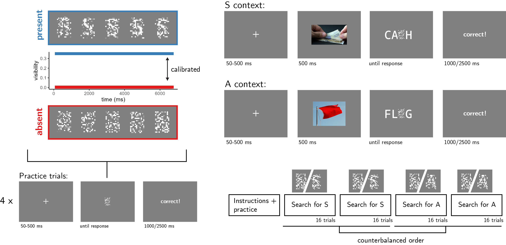
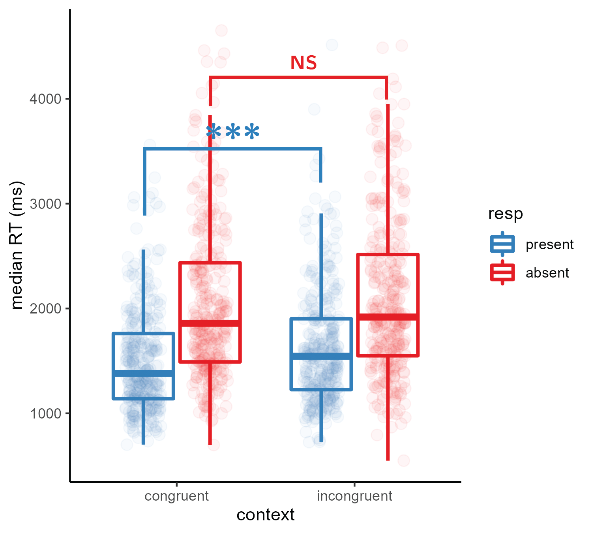

```{r setup, include = FALSE}
library("papaja")
r_refs("r-references.bib")
library('reticulate')
library('tidyverse')
library('broom')
library('cowplot')
library('MESS') # for AUCs
library('lsr') # for effect sizes
library('pwr') # for power calculations
library('brms') # for mixed effects modeling
library('BayesFactor') # for Bayesian t test
library('jsonlite') #parsing data from sort_trial
library('afex') #for anova
library('lmerTest') # for mixed effects modeling

```

```{python, include=FALSE, eval=FALSE}
import json
import pandas as pd
import numpy as np
from os import path as path

def to_csv(filename):
    dfs=[]
    with open(filename+'.txt') as json_file:
        for i,line in enumerate(json_file):
            if line[0:14]!='Consent given.':
                dfs.append(pd.read_json(line))


    group_df = pd.concat(dfs)
    group_df.to_csv(filename+'.csv', index=False)
    return(group_df)

# group_df = to_csv(path.join('..','experiments','pilots','letters','data','jatos_results_batch1'))
# group_df[group_df.trial_type=='survey-text'].responses

```


# Methods

NEED TO CHANGE TO PAST TENSE

## Participants

The research complies with all relevant ethical regulations, and was approved by the Research Ethics Committee of Birkbeck, University of London (study ID number 1812000). Participants will be recruited via Prolific, and will give informed consent prior to their participation. To be eligible to take part in this study, their Prolific approval rate will need to be 95% or higher, their reported first language English, and their age between 18 and 60. We will  collect data until we reach **300** included participants (after applying our pre-registered exclusion criteria). The entire experiment will take 11 minutes to complete. Participants will be paid £1.38 for their participation, equivalent to an hourly wage of £7.50.

## Procedure

Participants will detect the presence or absence of a target letter (S or A, in different blocks) in a patch of dynamic grayscale noise presented at 15 frames per second. In each frame, noise will be generated by randomly sampling grayscale values from a target image $I$. Specifically, for each pixel $S_{ij}$, we will display the grayscale value for the corresponding pixel in the original image $I_{ij}$ with some probability $p$, and the grayscale value of a randomly chosen pixel $I_{i'j'}$ with probability $1-p$. On target-absent trials, $p$ will be set to $0$, such that they grayscale values of all pixels will be randomly shuffled. On target-present trials, **$p$ will be calibrated online to achieve performance levels of around 80%, following a 1-up-3-down procedure, starting at $v=0.2$ ** and following a multiplicative set size of $0.9$, which will move closer to 1 following each change direction in the calibration process, **with a reset to $0.9$ after the second block, to allow separate staircasing for each letter**. Responses will be delivered using the F and G keyboard keys, and response-mapping will be counterbalanced across subjects.

```{r design, echo=FALSE, fig.cap="Experimental design. Top left: target visibility as a function of frame number for in target present (blue) and target absent (red) trials. Bottom left: trial structure in practice trials. Top right: trial structure in the main blocks of the experiment, in S- and A- context trials. Bottom right: overall experiment structure. ", out.width = '75%'}

```

After reading the instructions, participants will complete four practice trials. In case their accuracy in these four practice trials falls below 3/4, they will be reminded of task instructions and given additional practice trials, until they reach the desired accuracy level. Otherwise, they will continue to the main part of the experiment. Here, their task will be exactly the same, but the noise patch will be embedded in a congruent or incongruent context word. For example, when searching for the letter S, the context word CA_H (cash) is congruent but the context word FL_G (flag) is not (see Fig. \@ref(fig:design), upper right panel). To make sure participants are primed with the correct reading of the context word, an image of its meaning will be presented for 500 ms following the fixation cross and prior to the presentation of the noise display.

The main part of the experiment will comprise four blocks of 16 trials. For approximately half of the participants, in blocks 1 and 2 the target letter will be S and in blocks 3 and 4 it will be A. The order of letters will be reversed for the other half. All context words will be presented twice: once when detecting the letter S and once when detecting the letter A. As a result, all context words will be presented both as congruent and as incongruent contexts for the target letter. Overall, there will be 32 context words: 16 where the missing letter is an A and 16 where it is an S. All words will be 4- or 5-letter nouns with S or A in one of the central positions (i.e., position 2 or 3 in 4-letter words and position 3 in 5-letter words).

### Randomization

The order and timing of experimental events will be determined pseudo-randomly by the Mersenne Twister pseudorandom number generator, initialized in a way that ensures registration time-locking [@mazor2018novel]. 

## Data analysis

### Rejection criteria

Participants will be excluded if their accuracy falls below 50%. We will also exclude participants for having extremely fast or slow reaction times in one or more of the tasks (below 100 milliseconds or above 5 seconds in more than 25% of the trials). 

Trials with response time below 100 milliseconds or above 5 seconds will be excluded from the response-time analysis.

### Hypotheses and analysis plan

This study is designed to test several hypotheses about the effects of expectation and context on visual detection, with a focus on the timing of decisions to terminate evidence accumulation in the absence of a target as a potential window into self-modeling and metacognitive knowledge about perception and attention.

*Hypothesis 1 (PRESENCE/ABSENCE RESPONSE TIME)*: We will test the null hypothesis that response times are similar for target-absent and target-present responses, aiming to replicate the finding that decisions about the absence of a target are slower than decisions about its presence [@mazor2021metacognitive; @mazor2020distinct]. This will be tested using a paired t-test on the median individual level-response times. 

*Hypothesis 2 (CONTEXT IN PRESENCE)*: We will test the null hypothesis that target-present response times are similar when the context word matches or does not match the target letter. This will be tested using a paired t-test on the median individual level-response times .

*Hypothesis 3 (CONTEXT IN ABSENCE)*: We will test the null hypothesis that response times in target-absent responses are similar when the context word matches or does not match the target letter. This will be tested using a paired t-test on the median individual level-response times.

*Hypothesis 4 (CONTEXT RESPONSE INTERACTION)*: We will test the null hypothesis that the effect of context on reaction time is similar in target-absent and target-present responses. This will be tested by performing a group-level t-test on the subject-level contrast $(median(RT_{P,C})-median(RT_{P,I}))-(median(RT_{A,C})-median(RT_{A,I}))$ Where $P$, $A$, $C$ and $I$ stand for present, absent, congruent (matching) and incongruent (non-matching), respectively.

*Hypothesis 5 (SENSITIVITY)*: We will test the null hypothesis that sensitivity (measured as d') is equal in matching and non-matching contexts. To allow the extraction of d' for participants who committed no false-alarms or misses, we will add 0.5 to miss, hit, false-alarm and correct rejection counts [@snodgrass1988pragmatics].

*Hypothesis 6 (CRITERION)*: We will test the null hypothesis that decision criterion (measured as c) is equal in matching and non-matching contexts. To allow the extraction of a decision criterion for participants who committed no false-alarms or misses, we will add 0.5 to miss, hit, false-alarm and correct rejection counts [@snodgrass1988pragmatics].

*Hypothesis 7 (ABSENCE RESPONSE TIME)*: **We will test the null hypothesis that target-absent response times are similar in Experiments 1 and 2.  This will be tested using a  t-test for two samples on the median individual level-response times for target absence in Exp. 1 and 2. Since target-absent trials are identical in Experiments 1 and 2, a difference would indicate an indirect effect of target-present trials on target-absent response times, indicative of a dynamic adjustment of subjects' evidence accumulation termination heuristic.**

## Sample size justification

In Exp. 1, stansardized effect sizes for Hypotheses 2 (effect of context congruency on RT in target-present trials) and 4 (interaction between context congruency and target presence with respect to RT) were $0.19$ and $0.22$, respectively. Since our focus is on these effects of context congruency on decision time, and since these were the weakest effects in Exp. 1, we decided to test enough participants to obtain sufficient statistical power to test these hypotheses with high sensitivity. With 300 participants, we will have a statistical power of 93% to detect effect sizes of $0.2$ standard deviations.


# Results

```{r load_and_format_data, echo=FALSE, cache=TRUE}
E2.raw_df <- read_csv('../experiments/letters2/data/jatos_resultfiles_batch1/all_data.csv') %>%
  mutate(subj_id=PROLIFIC_PID,
         correct = as.numeric(correct),
         RT = as.numeric(RT),
         present=as.numeric(present),
         resp = response==presence_key,
         context=ifelse(context_string=='M SK','A',context)) #I accidentally coded this as S

E1.raw_df <- read_csv('../experiments/letters/data/jatos_resultfiles_batch1/all_data.csv') %>%
  mutate(subj_id=PROLIFIC_PID,
         correct = as.numeric(correct),
         RT = as.numeric(RT),
         present=as.numeric(present),
         resp = response==presence_key,
         context=ifelse(context_string=='M SK','A',context)) #I accidentally coded this as S

# pilot.export.df <- read_csv('../experiments/pilots/letters/data/prolific_export_batch2.csv')
```


```{r saveForMatt, echo=FALSE, cache=TRUE}
E2.raw_df %>% 
  filter(trial_type=='noisyLetter' & test_part %in% c('test1','test2')) %>%
    mutate(response = ifelse(response==presence_key,'present','absent'),
         congruent = target==context)%>%
  dplyr::select(subj_id,present,target,context_string,context,response,congruent,RT) %>%
  write_csv('../experiments/letters2/data/jatos_resultfiles_batch1/exp2Formatted.csv')

```


```{r exclusion, echo=FALSE, cache=TRUE}

E2.to_exclude <- E2.raw_df %>%
  filter(test_part=='test1' | test_part=='test2') %>%
  group_by(subj_id) %>%
  summarise(
    accuracy = mean(correct),
    first_quartile_RT = quantile(RT,0.25),
    third_quartile_RT = quantile(RT,0.75)
  ) %>%
  filter(accuracy<0.5 | first_quartile_RT<100 | third_quartile_RT>5000) %>%
    # filter(accuracy<0.5 | first_quartile_RT<100) %>%
  pull(subj_id)


E2.df <- E2.raw_df %>%
  filter(!(subj_id %in% E2.to_exclude));

E1.to_exclude <- E1.raw_df %>%
  filter(test_part=='test1' | test_part=='test2') %>%
  group_by(subj_id) %>%
  summarise(
    accuracy = mean(correct),
    first_quartile_RT = quantile(RT,0.25),
    third_quartile_RT = quantile(RT,0.75)
  ) %>%
  # filter(accuracy<0.5 | first_quartile_RT<100 | third_quartile_RT>5000)
    filter(accuracy<0.5 | first_quartile_RT<100) %>%
  pull(subj_id)


E1.df <- E1.raw_df %>%
  filter(!(subj_id %in% E1.to_exclude));

```

```{r comments, eval=FALSE}
E2.df%>%filter(trial_type=='survey-text')%>%pull(response)
```

```{r descriptives, echo=FALSE, cache=TRUE}

E2.overall_descriptives <- E2.df %>%
    filter(test_part=='test1' | test_part=='test2') %>%
    group_by(subj_id) %>%
    summarise(accuracy=mean(correct),
            resp_bias=mean(resp),
            slow_RT = quantile(RT,0.75)>5000,
            RT=median(RT),
            hit_rate = (sum(correct & present)+0.5)/(sum(present)+1),
            fa_rate = (sum(!correct & !present)+0.5)/(sum(!present)+1),
            d = qnorm(hit_rate)-qnorm(fa_rate),
            c = -0.5*(qnorm(hit_rate)+qnorm(fa_rate)))
```

`r E2.raw_df%>%pull(subj_id)%>%unique()%>%length()` participants completed the task. Mean accuracy in the main block experiment was `r E2.overall_descriptives%>%pull(accuracy)%>%mean()%>%printnum()` (SD=`r E2.overall_descriptives%>%pull(accuracy)%>%sd()%>%printnum()`). The mean median response time was `r printnum(E2.overall_descriptives%>%pull(RT)%>%mean()/1000)` seconds (SD=`r printnum(E2.overall_descriptives%>%pull(RT)%>%sd()/1000)`). 

## Hypothesis 1 (PRESENCE/ABSENCE RESPONSE TIME)

```{r H1, echo=FALSE, cache=TRUE}

E2.RT_by_resp <- E2.df %>%
  filter((test_part=='test1' | test_part=='test2') & RT>100) %>%
  group_by(subj_id,resp) %>%
  summarise(RT=median(RT))%>%
  spread(resp,RT,sep='')%>%
  mutate(diff=respTRUE-respFALSE)
```
Response times were significantly shorter in decisions about presence compared to absence (`r printnum(E2.RT_by_resp%>%pull(respTRUE)%>%mean()/1000)` vs `r printnum(E2.RT_by_resp%>%pull(respFALSE)%>%mean()/1000)` seconds; `r apa_print(E2.RT_by_resp%>%pull(diff)%>%t.test())$statistic`).

## Hypothesis 2 (CONTEXT IN PRESENCE)

```{r H2, echo=FALSE, cache=TRUE}

E2.RT_by_context_in_presence <- E2.df %>%
  filter((test_part=='test1' | test_part=='test2') & RT>100 & resp) %>%
  mutate(cong = target==context)%>%
  group_by(subj_id,cong) %>%
  summarise(RT=median(RT))%>%
  spread(cong,RT,sep='')%>%
  mutate(diff=congTRUE-congFALSE);

E2.RT_by_context_in_presence_correct_only <- E2.df %>%
  filter((test_part=='test1' | test_part=='test2') & RT>100 & resp & correct) %>%
  mutate(cong = target==context)%>%
  group_by(subj_id,cong) %>%
  summarise(RT=median(RT))%>%
  spread(cong,RT,sep='')%>%
  mutate(diff=congTRUE-congFALSE)

E2.RT_by_context_in_presence_incorrect_only <- E2.df %>%
  filter((test_part=='test1' | test_part=='test2') & RT>100 & resp & !correct) %>%
  mutate(cong = target==context)%>%
  group_by(subj_id,cong) %>%
  summarise(RT=median(RT))%>%
  spread(cong,RT,sep='')%>%
  mutate(diff=congTRUE-congFALSE)

E2.RT_by_context_in_presence_S_only <- E2.df %>%
  filter((test_part=='test1' | test_part=='test2') & RT>100 & resp & target=='S') %>%
  mutate(cong = target==context)%>%
  group_by(subj_id,cong) %>%
  summarise(RT=median(RT))%>%
  spread(cong,RT,sep='')%>%
  mutate(diff=congTRUE-congFALSE)

E2.RT_by_context_in_presence_A_only <- E2.df %>%
  filter((test_part=='test1' | test_part=='test2') & RT>100 & resp & target=='A') %>%
  mutate(cong = target==context)%>%
  group_by(subj_id,cong) %>%
  summarise(RT=median(RT))%>%
  spread(cong,RT,sep='')%>%
  mutate(diff=congTRUE-congFALSE)

E2.RT_by_context_in_presence_part1_only <- E2.df %>%
  filter(test_part=='test1'  & RT>100 & resp) %>%
  mutate(cong = target==context)%>%
  group_by(subj_id,cong) %>%
  summarise(RT=median(RT))%>%
  spread(cong,RT,sep='')%>%
  mutate(diff=congTRUE-congFALSE)

E2.RT_by_context_in_presence_part2_only <- E2.df %>%
  filter(test_part=='test2' & RT>100 & resp ) %>%
  mutate(cong = target==context)%>%
  group_by(subj_id,cong) %>%
  summarise(RT=median(RT))%>%
  spread(cong,RT,sep='')%>%
  mutate(diff=congTRUE-congFALSE)
```
Response times in decisions about presence were significantly shorter when the target letter appeared in a congruent compared to an incongruent context (`r printnum(E2.RT_by_context_in_presence%>%pull(congTRUE)%>%mean()/1000)` vs `r printnum(E2.RT_by_context_in_presence%>%pull(congFALSE)%>%mean()/1000)` seconds; `r apa_print(E2.RT_by_context_in_presence%>%pull(diff)%>%t.test())$statistic`). This was also the case when restricting the analysis to correct responses only (`r printnum(E2.RT_by_context_in_presence_correct_only%>%pull(congTRUE)%>%mean()/1000)` vs `r printnum(E2.RT_by_context_in_presence_correct_only%>%pull(congFALSE)%>%mean()/1000)` seconds; `r apa_print(E2.RT_by_context_in_presence_correct_only%>%pull(diff)%>%t.test())$statistic`).

## Hypothesis 3 (CONTEXT IN ABSENCE)

```{r H3, echo=FALSE, cache=TRUE}

E2.RT_by_context_in_absence <- E2.df %>%
  filter((test_part=='test1' | test_part=='test2') & RT>100 & !resp) %>%
  mutate(cong = target==context)%>%
  group_by(subj_id,cong) %>%
  summarise(RT=median(RT))%>%
  spread(cong,RT,sep='')%>%
  mutate(diff=congTRUE-congFALSE);

E2.RT_by_context_in_absence_correct_only <- E2.df %>%
  filter((test_part=='test1' | test_part=='test2') & RT>100 & !resp & correct) %>%
  mutate(cong = target==context)%>%
  group_by(subj_id,cong) %>%
  summarise(RT=median(RT))%>%
  spread(cong,RT,sep='')%>%
  mutate(diff=congTRUE-congFALSE)

E2.RT_by_context_in_absence_incorrect_only <- E2.df %>%
  filter((test_part=='test1' | test_part=='test2') & RT>100 & !resp & !correct) %>%
  mutate(cong = target==context)%>%
  group_by(subj_id,cong) %>%
  summarise(RT=median(RT))%>%
  spread(cong,RT,sep='')%>%
  mutate(diff=congTRUE-congFALSE)

E2.RT_by_context_in_absence_S_only <- E2.df %>%
  filter((test_part=='test1' | test_part=='test2') & RT>100 & !resp & target=='S') %>%
  mutate(cong = target==context)%>%
  group_by(subj_id,cong) %>%
  summarise(RT=median(RT))%>%
  spread(cong,RT,sep='')%>%
  mutate(diff=congTRUE-congFALSE)

E2.RT_by_context_in_absence_A_only <- E2.df %>%
  filter((test_part=='test1' | test_part=='test2') & RT>100 & !resp & target=='A') %>%
  mutate(cong = target==context)%>%
  group_by(subj_id,cong) %>%
  summarise(RT=median(RT))%>%
  spread(cong,RT,sep='')%>%
  mutate(diff=congTRUE-congFALSE)

E2.RT_by_context_in_absence_part1_only <- E2.df %>%
  filter(test_part=='test1'  & RT>100 & !resp ) %>%
  mutate(cong = target==context)%>%
  group_by(subj_id,cong) %>%
  summarise(RT=median(RT))%>%
  spread(cong,RT,sep='')%>%
  mutate(diff=congTRUE-congFALSE)

E2.RT_by_context_in_absence_part2_only <- E2.df %>%
  filter(test_part=='test2' & RT>100 & !resp ) %>%
  mutate(cong = target==context)%>%
  group_by(subj_id,cong) %>%
  summarise(RT=median(RT))%>%
  spread(cong,RT,sep='')%>%
  mutate(diff=congTRUE-congFALSE)
```
Response times in decisions about absence were similar when the target letter was expected to appear in a congruent or in an incongruent context (`r printnum(E2.RT_by_context_in_absence%>%pull(congTRUE)%>%mean()/1000)` vs `r printnum(E2.RT_by_context_in_absence%>%pull(congFALSE)%>%mean()/1000)` seconds; `r apa_print(E2.RT_by_context_in_absence%>%pull(diff)%>%t.test())$statistic`). Similarly, we found no effect of context on RT in decisions about absence also when restricting our analysis to correct trials only (`r apa_print(E2.RT_by_context_in_absence_correct_only%>%pull(diff)%>%t.test())$statistic`).

## Hypothesis 4 (CONTEXT RESPONSE INTERACTION)

```{r H4, echo=FALSE, cache=TRUE}

E2.RT_by_context_and_response <- merge(
  E2.RT_by_context_in_presence,
  E2.RT_by_context_in_absence,
  by= 'subj_id',
  suffixes = c('presence','absence')) %>%
  mutate(interaction = diffpresence-diffabsence);

E2.RT_by_context_and_response_correct_only <- merge(
  E2.RT_by_context_in_presence_correct_only,
  E2.RT_by_context_in_absence_correct_only,
  by= 'subj_id',
  suffixes = c('presence','absence')) %>%
  mutate(interaction = diffpresence-diffabsence);

E2.RT_by_context_and_response_S_only <- merge(
  E2.RT_by_context_in_presence_S_only,
  E2.RT_by_context_in_absence_S_only,
  by= 'subj_id',
  suffixes = c('presence','absence')) %>%
  mutate(interaction = diffpresence-diffabsence);

E2.RT_by_context_and_response_A_only <- merge(
  E2.RT_by_context_in_presence_A_only,
  E2.RT_by_context_in_absence_A_only,
  by= 'subj_id',
  suffixes = c('presence','absence')) %>%
  mutate(interaction = diffpresence-diffabsence);

E2.RT_by_context_and_response_part1_only <- merge(
  E2.RT_by_context_in_presence_part1_only,
  E2.RT_by_context_in_absence_part1_only,
  by= 'subj_id',
  suffixes = c('presence','absence')) %>%
  mutate(interaction = diffpresence-diffabsence);

E2.RT_by_context_and_response_part2_only <- merge(
  E2.RT_by_context_in_presence_part2_only,
  E2.RT_by_context_in_absence_part2_only,
  by= 'subj_id',
  suffixes = c('presence','absence')) %>%
  mutate(interaction = diffpresence-diffabsence);
```

The effect of context congruency on response time was stronger in decisions about target presence, compared to decisions about target absence (`r apa_print(E2.RT_by_context_and_response%>%pull(interaction)%>%t.test())$statistic`). The effect was also significant when restricting the analysis to correct responses only (`r apa_print(E2.RT_by_context_and_response_correct_only%>%pull(interaction)%>%t.test())$statistic`).

```{r Exp1results, echo=FALSE, fig.cap="Reaction time results", out.width = '75%'}

```

## Hypothesis 5 (SENSITIVITY)

```{r SDT, echo=FALSE, cache=TRUE}

E2.descriptives_by_context<- E2.df %>%
  filter(test_part=='test1' | test_part=='test2') %>%
  mutate(cong = target==context,
         resp = response==presence_key)%>%
  group_by(subj_id,cong) %>%
  summarise(accuracy=mean(correct),
            resp_bias=mean(resp),
            RT=median(RT),
            hit_rate = (sum(correct & present)+0.5)/(sum(present)+1),
            fa_rate = (sum(!correct & !present)+0.5)/(sum(!present)+1),
            d = qnorm(hit_rate)-qnorm(fa_rate),
            c = -0.5*(qnorm(hit_rate)+qnorm(fa_rate)))
```
Signal detection sensitivity was `r E2.descriptives_by_context %>%filter(cong)%>%pull(d)%>%mean() %>%printnum()` (SD=`r E2.descriptives_by_context %>%filter(cong)%>%pull(d)%>%sd()%>%printnum()`) when the context matched the target letter, and `r E2.descriptives_by_context %>%filter(!cong)%>%pull(d)%>%mean() %>%printnum()` (SD=`r E2.descriptives_by_context %>%filter(!cong)%>%pull(d)%>%sd()%>%printnum()`) when it did not match the target letter. Sensitivity was significantly higher for congruent contexts (`r apa_print(E2.descriptives_by_context %>%select(subj_id,cong,d)%>%spread(cong,d,sep='')%>%mutate(diff=congTRUE-congFALSE)%>%pull(diff)%>%t.test)$statistic`).

## Hypothesis 6 (CRITERION)

Signal detection criterion was overall positive, indicating that participants were conservative in their responses, and was lower in congruent (`r E2.descriptives_by_context %>%filter(cong)%>%pull(c)%>%mean() %>%printnum()`; SD=`r E2.descriptives_by_context %>%filter(cong)%>%pull(c)%>%sd()%>%printnum()`) than in incongruent (`r E2.descriptives_by_context %>%filter(!cong)%>%pull(c)%>%mean() %>%printnum()`; SD=`r E2.descriptives_by_context %>%filter(!cong)%>%pull(c)%>%sd()%>%printnum()`) contexts (`r apa_print(E2.descriptives_by_context %>%select(subj_id,cong,c)%>%spread(cong,c,sep='')%>%mutate(diff=congTRUE-congFALSE)%>%pull(diff)%>%t.test)$statistic`). This is in contrast to our finding from Exp. 1, where context had no effect on decision criterion. 

Exploratory analysis revealed that hit rate was higher in congruent (`r E2.descriptives_by_context %>%filter(cong)%>%pull(hit_rate)%>%mean() %>%printnum()`) compared to incongruent contexts (`r E2.descriptives_by_context %>%filter(!cong)%>%pull(hit_rate)%>%mean() %>%printnum()`; `r apa_print(E2.descriptives_by_context %>%select(subj_id,cong,hit_rate)%>%spread(cong,hit_rate,sep='')%>%mutate(diff=congTRUE-congFALSE)%>%pull(diff)%>%t.test)$statistic`), whereas false alarm rate was similar in congruent (`r E2.descriptives_by_context %>%filter(cong)%>%pull(fa_rate)%>%mean() %>%printnum()`) and incongruent contexts (`r E2.descriptives_by_context %>%filter(!cong)%>%pull(fa_rate)%>%mean() %>%printnum()`; `r apa_print(E2.descriptives_by_context %>%select(subj_id,cong,fa_rate)%>%spread(cong,fa_rate,sep='')%>%mutate(diff=congTRUE-congFALSE)%>%pull(diff)%>%t.test)$statistic`).


## Hypothesis 7 (ABSENCE RESPONSE TIME)

```{r H7, echo=FALSE, cache=TRUE}

E1.RT_by_resp <- E1.df %>%
  filter((test_part=='test1' | test_part=='test2') & RT>100) %>%
  group_by(subj_id,resp) %>%
  summarise(RT=median(RT))%>%
  spread(resp,RT,sep='')%>%
  mutate(diff=respTRUE-respFALSE)
```

'Target absent' response times were overall lower in Exp. 2 (`r (E2.RT_by_resp$respFALSE%>%mean()/1000)%>%printnum()` seconds) compared to Exp. 1 (`r (E1.RT_by_resp$respFALSE%>%mean()/1000)%>%printnum()`; `r apa_print(t.test(E1.RT_by_resp$respFALSE,E2.RT_by_resp$respFALSE))$statistic`). Since target-absent displays were identical in both experiments, this indicates an adaptive adjustment of a decision criterion based on target-present trials. 


```{r Figure, echo=FALSE, cache=TRUE}

N_perm <- 1000;
bootstrap_error <- function(x, N_perm) {
  N <- length(x)
  medians = c();
  for (i in 1:N_perm) {
    medians = c(medians,sample(x,replace=TRUE,size=N)%>%median())
  };
  return(sd(medians))
}

E2.RT_per_cell <- E2.df %>%
  filter((test_part=='test1' | test_part=='test2') & RT>100) %>%
  mutate(cong=target==context)%>%
  group_by(subj_id,resp,cong) %>%
  summarise(RT=median(RT))

E2.RT_per_cell_correct_only <- E2.df %>%
  filter((test_part=='test1' | test_part=='test2') & RT>100 & correct) %>%
  mutate(cong=target==context)%>%
  group_by(subj_id,resp,cong) %>%
  summarise(RT=median(RT))

E2.RT_per_cell_incorrect_only <- E2.df %>%
  filter((test_part=='test1' | test_part=='test2') & RT>100 & !correct) %>%
  mutate(cong=target==context)%>%
  group_by(subj_id,resp,cong) %>%
  summarise(RT=median(RT))


p <- E2.RT_per_cell %>% 
  mutate(resp=ifelse(resp, 'present','absent'),
         cong=ifelse(cong,'congruent','incongruent'),
         resp=factor(resp,levels=c('present','absent'))) %>%
  ggplot(aes(x=cong,fill=resp,y=RT, color=resp)) +
  geom_boxplot(size=1,fill='white',outlier.alpha=0) +
  geom_point(position=position_jitterdodge(),alpha=0.2,size=3, show.legend=FALSE)+
  theme_classic() + 
  labs(x='context', y='median RT (ms)',fill='response')+
  scale_color_manual(values=c("#377eb8", "#e41a1c")) +
  scale_fill_manual(values=c("#377eb8", "#e41a1c")) +
  coord_flip()

ggsave('figures/E2_RT_by_cong_resp.png',p,width=6,height=3.125)
```


```{r resp_Figure, echo=FALSE, cache=TRUE}


E2.resp_per_cell <- E2.df %>%
  filter(test_part=='test1' | test_part=='test2') %>%
  mutate(cong=target==context)%>%
  group_by(subj_id,present,cong) %>%
  summarise(resp=mean(resp))

p <- E2.resp_per_cell %>% 
  mutate(present=factor(ifelse(present, 'present','absent'), levels=c('present','absent')),
         cong=ifelse(cong,'congruent','incongruent')) %>%
  ggplot(aes(x=cong,fill=present,y=resp, color=present)) +
  geom_boxplot(size=1,fill='white',outlier.alpha=0) +
  geom_point(position=position_jitterdodge(),alpha=0.1,size=3, show.legend=FALSE)+
  theme_classic() + 
  labs(x='context', y='p(respond present)',fill='target presence')+
  scale_color_manual(values=c("#377eb8", "#e41a1c")) +
  scale_fill_manual(values=c("#377eb8", "#e41a1c"))+
  coord_flip()

ggsave('figures/E2_resp_by_cong_resp.png',p,width=6,height=2)
```


```{r format_for_nondirectional_analysis, eval=FALSE, echo=FALSE}
E2.df %>%   
  filter((test_part=='test1' | test_part=='test2') & RT>100 & correct & resp) %>%
  mutate(cong=ifelse(target==context,1,0),
         subNum = subj_id,
         rt=RT,
         Exp='E2') %>%
  select(subNum,rt,cong, Exp) %>%
  write.csv('../../nondirectionalPriming/data/Mazor_inPrep_exp2.csv')
```

```{r format_for_HDDM, eval=FALSE, echo=FALSE}
E2.df %>%   
  filter((test_part=='test1' | test_part=='test2') & RT>100) %>%
  mutate(cong=ifelse(target==context,1,0),
         subj_idx = as.numeric(factor(subj_id)),
         rt=RT/1000,
         stim=ifelse(present,1,0),
         response=ifelse(resp,1,0)) %>%
  select(subj_idx,stim,cong,rt,response) %>%
  write.csv('../experiments/letters/data/jatos_resultfiles_batch1/exp2forHDDM.csv')

E2.df %>%   
  filter((test_part=='test1' | test_part=='test2') & RT>100) %>%
  mutate(cong=ifelse(target==context,1,0),
         subj_idx = as.numeric(factor(subj_id)),
         present = ifelse(present,1,0),
         rt=RT/1000,
         response=ifelse(correct,1,0)) %>%
  select(subj_idx,cong,rt,present,response) %>%
  write.csv('../experiments/letters/data/jatos_resultfiles_batch1/exp2accuracyCodedForHDDM.csv')

```

```{r quartiles, echo=FALSE, cache=TRUE}

E2.accuracy_by_quartile <- E2.df %>%
  filter(test_part=='test1' | test_part=='test2') %>%
  mutate(cong = target==context,
         resp = response==presence_key)%>%
  group_by(subj_id,cong,present) %>%
  mutate(RTq = ntile(RT,4)) %>%
  select(subj_id, cong, present, RTq, RT, correct) %>%
  group_by(subj_id,present,RTq, cong) %>%
  summarise(acc=mean(correct))

p<- E2.accuracy_by_quartile  %>%
  group_by(present,RTq, cong) %>%
  summarise(acc=mean(acc))%>%
  spread(cong,acc,sep='_') %>%
  mutate(cong_effect = cong_TRUE-cong_FALSE) %>% ggplot(
  aes(x=RTq,y=cong_effect,fill=factor(present))
) + geom_bar(stat='identity', position='dodge') +
  labs(x='quartile',y='congruency effect (cong-incong)',fill='stimulus present')

ggsave('figures/E2_RT_by_cong_resp_quartile.png',p,width=5,height=4.5)


```
## EXPLORATORY: REPETITION EFFECTS

```{r rep-presence, echo=FALSE, cache=TRUE, eval=FALSE}

otherLetter <- function(letter) {
  if (letter=='S') {
    return('A')
  } else if (letter=='A') {
    return('S')
  }
}

E2.context_df <- E2.df %>%
  filter((test_part=='test1' | test_part=='test2') & RT>100) %>%
  rowwise()%>%
  mutate(rep = grepl(target,context_string,fixed=TRUE),
         repOther = grepl(otherLetter(target),context_string,fixed=TRUE),
         targetIsS = target=='S',
         cong=target==context) %>%
  select(subj_id,target,present,cong,rep,repOther,targetIsS,context_string,target, RT,correct)

# m_absence <- lmer(RT ~ cong + rep + targetIsS + (1|subj_id),data=E2.context_df %>%filter(correct & present==0));
# 
# anova(m_absence)

# m_presence <- lmer(RT ~ cong + rep + targetIsS + (1|subj_id),data=E2.context_df %>%filter(correct & present==1))

# anova(m_presence)

E2.sub_class <- E2.df %>%
  filter((test_part=='test1' | test_part=='test2') & RT>100 & (
      context_string == 'TR SH' |
      context_string == 'TO ST' |
      context_string == 'SW N' |
      context_string == 'PA TA' |
      context_string == 'VA E' |
      context_string == 'WA H' |
      context_string == 'C RT' |
      context_string == 'CO L' |
      context_string == 'FL G' |
      context_string == 'CO T' |
      context_string == 'BU H' |
      context_string == 'FI H' |
      context_string == 'HO E' |
      context_string == 'NO E' |
      context_string == 'BE R' |
      context_string == 'LE F' |
      context_string == 'B LL' |
      context_string == 'BE N' |
      context_string == 'DE K' |
      context_string == 'DU T' |
      context_string == 'NE T' |
      context_string == 'PO T'
  )) %>%
  rowwise()%>%
  mutate(rep = grepl(target,context_string,fixed=TRUE),
         repOther = grepl(otherLetter(target),context_string,fixed=TRUE),
         targetIsS = target=='S',
         cong=target==context) %>%
  select(subj_id,target,present,cong,rep,repOther,targetIsS,context_string,target, RT,correct)

E2.RT_by_rep_in_presence <- E2.sub_class %>%
  filter(correct & present) %>%
  group_by(subj_id,rep) %>%
  summarise(RT=median(RT))%>%
  spread(rep,RT,sep='')%>%
  mutate(diff=repTRUE-repFALSE);

E2.RT_by_rep_in_absence <- E2.sub_class %>%
  filter(correct & !present) %>%
  group_by(subj_id,rep) %>%
  summarise(RT=median(RT))%>%
  spread(rep,RT,sep='')%>%
  mutate(diff=repTRUE-repFALSE);

E2.RT_by_repOther_in_presence <- E2.sub_class %>%
  filter(correct & present) %>%
  group_by(subj_id,repOther) %>%
  summarise(RT=median(RT))%>%
  spread(repOther,RT,sep='')%>%
  mutate(diff=repOtherTRUE-repOtherFALSE);

E2.RT_by_repOther_in_absence <- E2.sub_class %>%
  filter(correct & !present) %>%
  group_by(subj_id,repOther) %>%
  summarise(RT=median(RT))%>%
  spread(repOther,RT,sep='')%>%
  mutate(diff=repOtherTRUE-repOtherFALSE);

```

```{r Figure, echo=FALSE, cache=TRUE}


N_perm <- 1000;
bootstrap_error <- function(x, N_perm) {
  N <- length(x)
  medians = c();
  for (i in 1:N_perm) {
    medians = c(medians,sample(x,replace=TRUE,size=N)%>%median())
  };
  return(sd(medians))
}

E2.RT_per_cell_rep <- E2.sub_class %>%
  mutate(resp = ifelse(present,1,0)) %>%
  group_by(subj_id,resp,rep) %>%
  summarise(RT=median(RT))


p <- E2.RT_per_cell_rep %>% 
  mutate(resp=ifelse(resp, 'present','absent'),
         rep=ifelse(rep,'repetition','no_repetition'),
         resp=factor(resp,levels=c('present','absent'))) %>%
  ggplot(aes(x=rep,fill=resp,y=RT, color=resp)) +
  geom_boxplot(size=1,fill='white',outlier.alpha=0) +
  geom_point(position=position_jitterdodge(),alpha=0.05,size=3, show.legend=FALSE)+
  theme_classic() + 
  labs(x='context', y='median RT (ms)',fill='response')+
  scale_color_manual(values=c("#377eb8", "#e41a1c")) +
  scale_fill_manual(values=c("#377eb8", "#e41a1c"))

ggsave('figures/E2_RT_by_rep_resp.png',p,width=5,height=4.5)
```

```{r quantiles, echo=FALSE, cache=TRUE}

E2.accuracy_by_quartile <- E2.df %>%
  filter(test_part=='test1' | test_part=='test2') %>%
  mutate(cong = target==context,
         resp = response==presence_key)%>%
  group_by(subj_id,cong,present) %>%
  mutate(RTq = ntile(RT,4)) %>%
  select(subj_id, cong, present, RTq, RT, correct) %>%
  group_by(subj_id,present,RTq, cong) %>%
  summarise(acc=mean(correct))

p<- E2.accuracy_by_quartile  %>%
  group_by(present,RTq, cong) %>%
  summarise(acc=mean(acc))%>%
  spread(cong,acc,sep='_') %>%
  mutate(cong_effect = cong_TRUE-cong_FALSE) %>% ggplot(
  aes(x=RTq,y=cong_effect,fill=factor(present))
) + geom_bar(stat='identity', position='dodge') +
  labs(x='quartile',y='congruency effect (cong-incong)',fill='stimulus present')

ggsave('figures/E2_RT_by_cong_resp_quartile.png',p,width=5,height=4.5)

# a function to map the quantiles of target absent search times to
# target present search times.
mapQuantiles <- function(x,y,probs) {
  x_quantiles = quantile(x,probs)
  percentile <- ecdf(y);
  return(percentile(x_quantiles))
}

E2.quantiles <- E2.df %>%
  filter((test_part=='test1' | test_part=='test2') & RT>100 & correct) %>%
  mutate(cong = target==context)%>%
  group_by(subj_id,cong) %>%
  summarise(enframe(mapQuantiles(
    RT[!resp],
    RT[resp],
    seq(0,1,0.1)
  ), "quantile_absent", "quantile_present"),
  quantile_absent = seq(0,1,0.1)) 

E2.quantile_summary <- E2.quantiles %>% 
  group_by(subj_id,cong) %>%
  summarise(quantile_present=mean(quantile_present)) %>%
  group_by(subj_id) %>%
  summarise(diff=mean(quantile_present[cong])-
              mean(quantile_present[!cong])) 

E2.quantile_plot <- E2.quantiles %>% 
  group_by(cong,quantile_absent) %>% 
  summarise(mean_quantile_present=mean(quantile_present),
            se_quantile_present = se(quantile_present)) %>% 
  ggplot(aes(x=quantile_absent, 
             y=mean_quantile_present, 
             color=cong)) +
  geom_line(size=1)+
  geom_ribbon(aes(x=quantile_absent, 
                  ymin=mean_quantile_present-se_quantile_present,
                  ymax=mean_quantile_present+se_quantile_present, fill=cong),
              alpha=0.5)+
  scale_x_continuous(limits=c(0,1), breaks = seq(0,1,0.1))+
  scale_y_continuous(limits=c(0,1), breaks = seq(0,1,0.1))+
  labs(x='target-absent responses',
       y='target-present responses',
       title='Detection quantiles')+
  theme_bw() +
  scale_fill_manual(values = c("black","#377eb8"))+
  scale_color_manual(values = c("black","#377eb8"))+
  coord_fixed()

ggsave('figures/E2Quantiles.png',E2.quantile_plot,width=5,height=5);

```
# Discussion


\newpage

# References

\begingroup
\setlength{\parindent}{-0.5in}
\setlength{\leftskip}{0.5in}

<div id="refs" custom-style="Bibliography"></div>
\endgroup
