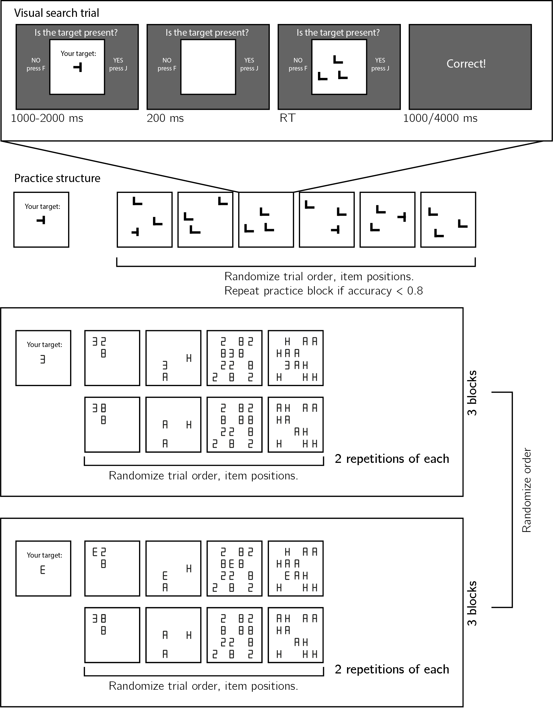

```{r setup, include = FALSE}
library("papaja")
library('pwr')
library('dplyr')
library('tidyverse')
library('broom')
knitr::opts_chunk$set(fig.pos = "!H", out.extra = "")
```

```{r analysis-preferences}
# Seed for random number generation
set.seed(42)
knitr::opts_chunk$set(cache.extra = knitr::rand_seed)
```

# Motivation

Perceptual decisions are influenced not only by incoming sensory input, but also by our own expectations and motivations. For example, stimuli that are predictable in a given context can appear sharper [@rossel2022makes] and are more likely to be perceived when presented at near-threshold intensity [@yon2020action; @reznik2014lateralized]. Apparently opposite effects are also sometimes observed, whereby expected events are perceived less readily than their unexpected counterparts [@press2020perceptual]. There are many unanswered questions concerning what contributes to the influence of expectations on perceptual experience. One likely contributing factor concerns whether subjects believe (explicitly or implicitly) that they will detect expected or unexpected events more readily, and whether they are able to utilize these beliefs in guiding their information gathering behaviour. 

In two previous studies we used the timing of decisions about absence in a detection task to investigate implicit beliefs about facilitating effects of expectation on perception. We used a paradigm where expected events are detected more readily than unexpected events: subjects are faster to detect letters when surrounded by other letters that make it into a meaningful word. We replicated this effect of context on the timing of decisions about presence, but found that context did not significantly modulate the efficiency of decisions about target absence. This finding is consistent with the absence of metacognitive representation of the facilitating effects of expectations on perception.

In this third Experiment, we tested the generalizability of this finding to a setting where expectation has the oppposite effect on perception. In a previous Visual Search Experiment [@mazor2022prospective], searches were faster on average when the target was semantically incongruent relative to the distractors. In that study, however, the target was always present, and participants' task was to locate it in the array.  Here, we ask whether a similar advantage for target-distractor incongruency will be observed in decisions about the absence of a target.  

<!-- By examining the timing of decisions about target absence in the very first trials of the task [@mazor2022efficient], we distill stimulus-specific search termination mechanisms from generic criterion-adjustment heuristics [@chun1996just].  -->


# Methods
We report how we determined our sample size, all data exclusions (if any), all manipulations, and all measures in the study. <!-- 21-word solution (Simmons, Nelson & Simonsohn, 2012; retrieved from http://ssrn.com/abstract=2160588) -->

## Participants

The research complies with all relevant ethical regulations, and was approved by the Research Ethics Committee of Birkbeck, University of London (study ID number 1812000). Participants will be recruited via Prolific, and will give informed consent prior to their participation. To be eligible to take part in this study, their Prolific approval rate will need to be 95% or higher, their reported first language English, their vision normal or corrected to normal, and their age between 18 and 60. We will collect data until we reach 150 included participants for each hypothesis (after applying our pre-registered exclusion criteria), or until we collect a total of 220 participants. The entire experiment will take 12 minutes to complete. Participants will be paid £1.80 for their participation, equivalent to an hourly wage of £9.


## Procedure

Participants will first be instructed about the visual search task. Specifically, that their task is to report, as accurately and quickly as possible, whether a target stimulus was present (press 'J') or absent (press 'F'). Then, practice trials will be delivered, in which the target stimulus is a rotated T and distractors are L's. The purpose of the practice trials is to familiarize participants with the structure of the task. For these practice trials the number of items will always be 3. Practice trials will be delivered in small blocks of 6 trials each, and the main part of the experiment will start only once participants respond correctly on at least five trials in a block (see Figure \@ref(fig:design)). 


```{r design, echo=FALSE, fig.cap="Experimental design. Top panel: each visual search trial will start with a screen indicating the target stimulus. The search display will remain visible until a response is recorded. To motivate accurate responses, the feedback screen will remain visible for one second following correct responses and for four seconds following errors. Middle panel: after reading the instructions, participants will practice the visual search task in blocks of 6 trials, until they reach an accuracy level of 5/6 correct or higher (at most one error per block of 6 trials). Bottom panel: the main part of the experiment will comprise six blocks of 16 trials each, in which the target will be a 3 or an E, set size will be 3 or 12, and distractors will be letters or numbers.", out.width = '60%'}

```

The main part of the experiment will comprise two conditions (searching for the letter E, or for the digit 3), presented in six blocks. The order of conditions will be counterbalanced across participants. 

Set size (3 or 12), distractor set (the digits 8 and 2 or the letters A and H), and target presence will be manipulated independently within a block. The first four trials in the third and sixth blocks will be target-absent trials: 3 letter, 12 letters, 3 digits, and 12 digits. Distractors were chosen to be equally similar to the two targets in terms of the number of lines that need to be added and/or subtracted in order to get from the target letter to each of the distractors. We were able to keep both letter distractors (A and H) symmetric. Since the two targets are perfect mirror images of each other, this ensures that visual similarity to both letter targets is identical. In the case of digit distractors, however, the digit 8 is symmetric but the digit 2 is not. As a result, differences in visual search efficiency between the two targets may still be affected by visual similarity (for example, the digits 2 and 3 are both perceived as facing the left, but the letter E is facing the right). Importantly, this is the case when searching among digits, but not among letters. 

### Randomization

The order and timing of experimental events will be determined pseudo-randomly by the Mersenne Twister pseudorandom number generator, initialized in a way that ensures registration time-locking [@mazor2019novel]. 

## Data analysis

### Rejection criteria

Participants will be excluded for having overall accuracy below 75%, or for having extremely fast or slow reaction times in one or more of the conditions (below 100 milliseconds or above 5 seconds in more than 25% of the trials). 

Error trials, and trials with response time below 100 milliseconds or above 5 second will be excluded from the response-time analysis.


# Results


We used `r cite_r(file = "r-references.bib", pkgs = c("dplyr", "ggplot2", "tidyverse","papaja","broom"), withhold = FALSE)` for all our analyses.

```{r load_data, echo=FALSE, cache=TRUE, warning=FALSE}

Evs3.df <- read.csv('..\\experiments\\EsVs3s\\data\\jatos_results_batch1.txt',na.strings=c(""," ","NA")) %>%
  filter(trial_type=='p5vs_yn' & (test_part=='main' | test_part=='absence1')) %>%
  mutate(subj_id=subject_identifier,
         RT=as.numeric(RT),
         set_size=as.numeric(set_size),
         correct = correct=='true',
         target_present = target_present=='true',
         block=as.numeric(block),
         search_type=ifelse(search_type=='threeInNumm','threeInNum',search_type))%>%
  dplyr::select(subj_id,three_first,RT,correct,set_size,target_present,search_type, block, test_part, block, trial_index)


Evs3.time_taken <-read.csv('..\\experiments\\EsVs3s\\data\\prolific_export_batch1.csv',na.strings=c(""," ","NA")) %>%
  filter(Status=='APPROVED') %>%
  pull(Time.taken)

Evs3.summary_stats = Evs3.df %>%
  group_by(subj_id) %>%
  summarise(acc=mean(correct),
            nerrors_first = sum(!correct & test_part=='absence1'),
            RT25=quantile(RT,0.25),
            RT50=quantile(RT,0.50),
            RT75=quantile(RT,0.75))

Evs3.included = Evs3.summary_stats %>%
  filter(acc>=0.75 &
           RT25>100 &
           RT75<5000) %>%
  pull(subj_id)

N_total <- Evs3.df$subj_id%>%unique()%>%length()
```


## Participants

We collected data from a total of `r N_total` participants, recruited on Prolific. The entire experiment took 13:15 minutes to complete (median completion time: 13:15 minutes). Participants were paid £1.80 for their participation, equivalent to an hourly wage of £8.15. The data of `r Evs3.included%>%length()` participants met our inclusion criteria and were used for the main analysis.

```{r search-time-analysis, echo=FALSE, cache=TRUE}

Evs3.RT_by_position <- Evs3.df %>%
  group_by(subj_id)%>%
  mutate(i=seq_along(RT))%>%
  group_by(i) %>%
  summarise(RT=mean(RT))

Evs3.mean_RT <- Evs3.df$RT %>% mean()

# preprocessed df, correcting for trial order effects.
# this will be used in analyzing the first trials.
Evs3.pp_df <- Evs3.df %>%
  group_by(subj_id) %>%
  mutate(i=seq_along(RT)) %>%
  rowwise() %>%
  mutate(meanRT_per_i = Evs3.RT_by_position$RT[Evs3.RT_by_position$i==i],
         RTcorrected = RT-meanRT_per_i+Evs3.mean_RT)

# Search slopes by congruency
Evs3.congSlopes <- Evs3.df %>%
  filter(subj_id %in% Evs3.included &
           correct &
           RT>100 &
           RT<5000) %>%
  mutate(cong=ifelse(search_type %in% c('EinLet','threeInNum'),'cong','incong')) %>%
  group_by(subj_id,cong, target_present) %>%
  do(model=lm(RT~set_size,data=.)) %>%
  mutate(tidys=list(broom::tidy(model))) %>%
  unnest(tidys) %>%
  filter(term=='set_size') %>%
  dplyr::select(subj_id,cong,target_present,estimate) %>%
  spread(cong,estimate) %>%
  mutate(diff=cong-incong)

# Search slopes by congruency: test hypotheses
Evs3.congSlopesTests <- Evs3.congSlopes %>%
  dplyr::select(subj_id,target_present,diff) %>%
  spread(target_present,diff,sep='_') %>%
  rename(H1 = target_present_TRUE,
         H2 = target_present_FALSE) %>%
  mutate(H3=H1*2-H2)

# Search slopes by congruency: letter distractors only
Evs3.letters.congSlopes <- Evs3.df %>%
  filter(subj_id %in% Evs3.included &
           correct &
           RT>100 &
           RT<5000 &
           search_type %in% c('EinLet', 'threeInLet')) %>%
  mutate(cong=ifelse(search_type =='EinLet','cong','incong')) %>%
  group_by(subj_id,cong, target_present) %>%
  do(model=lm(RT~set_size,data=.)) %>%
  mutate(tidys=list(broom::tidy(model))) %>%
  unnest(tidys) %>%
  filter(term=='set_size') %>%
  dplyr::select(subj_id,cong,target_present,estimate) %>%
  spread(cong,estimate) %>%
  mutate(diff=cong-incong)

# Search slopes by congruency: test hypotheses for letter distractors only
Evs3.letters.congSlopesTests <- Evs3.letters.congSlopes %>%
  dplyr::select(subj_id,target_present,diff) %>%
  spread(target_present,diff,sep='_') %>%
  rename(H1 = target_present_TRUE,
         H2 = target_present_FALSE) %>%
  mutate(H3=H1*2-H2)

# Search slopes by congruency: number distractors only
Evs3.numbers.congSlopes <- Evs3.df %>%
  filter(subj_id %in% Evs3.included &
           correct &
           RT>100 &
           RT<5000 &
           search_type %in% c('EinNum', 'threeInNum')) %>%
  mutate(cong=ifelse(search_type == 'threeInNum','cong','incong')) %>%
  group_by(subj_id,cong, target_present) %>%
  do(model=lm(RT~set_size,data=.)) %>%
  mutate(tidys=list(broom::tidy(model))) %>%
  unnest(tidys) %>%
  filter(term=='set_size') %>%
  dplyr::select(subj_id,cong,target_present,estimate) %>%
  spread(cong,estimate) %>%
  mutate(diff=cong-incong)

# Search slopes by congruency: test hypotheses in number distractors only
Evs3.numbers.congSlopesTests <- Evs3.numbers.congSlopes %>%
  dplyr::select(subj_id,target_present,diff) %>%
  spread(target_present,diff,sep='_') %>%
  rename(H1 = target_present_TRUE,
         H2 = target_present_FALSE) %>%
  mutate(H3=H1*2-H2)

# Search slopes by congruency: first trials
Evs3.firstAbsence <- Evs3.pp_df %>%
  filter(subj_id %in% Evs3.included &
           correct &
           RT>100 &
           RT<5000 &
           test_part=='absence1') %>%
  group_by(subj_id,search_type) %>%
  summarise(slope=(RTcorrected[set_size==12]-RTcorrected[set_size==3])/9)%>%
  spread(search_type,slope) %>%
  mutate(cong = (EinLet+threeInNum)/2,
         incong = (EinNum+threeInLet)/2,
         diff = cong-incong,
         diff_letters = EinLet-threeInLet,
         diff_numbers = EinNum-threeInNum)

# Search slopes by congruency: first presence trials
Evs3.firstPresence <- Evs3.pp_df %>%
  filter(subj_id %in% Evs3.included &
           correct &
           RT>100 &
           RT<5000 &
           target_present) %>%
  group_by(subj_id,search_type,set_size)%>%
  summarise(RTcorrected = RTcorrected[1]) %>%
  group_by(subj_id,search_type) %>%
  summarise(slope=(RTcorrected[set_size==12]-RTcorrected[set_size==3])/9)%>%
  spread(search_type,slope) %>%
  mutate(cong = (EinLet+threeInNum)/2,
         incong = (EinNum+threeInLet)/2,
         diff = cong-incong,
         diff_letters = EinLet-threeInLet,
         diff_numbers = EinNum-threeInNum)
```


```{r search-time-figures, echo=FALSE, cache=TRUE}

N_perm <- 1000;
bootstrap_error <- function(x, N_perm) {
  N <- length(x)
  medians = c();
  for (i in 1:N_perm) {
    medians = c(medians,sample(x,replace=TRUE,size=N)%>%median())
  };
  return(sd(medians))
}

Evs3.RTplot <- Evs3.df %>%
  filter(correct & subj_id %in% Evs3.included) %>%
  group_by(target_present, 
           search_type,set_size, 
           subj_id) %>%
  summarise(RT=mean(RT)) %>%
  group_by(target_present,
           search_type,
           set_size)%>%
  summarise(se_RT=se(RT),
            mean_RT=mean(RT))%>%
  mutate(target=factor(substr(search_type,0,1),
                       levels=c('E','t'), labels=c('E','3')),
         distractors=factor(ifelse(search_type %in% c('EinLet', 'threeInLet'),
                                   'letters', 'numbers'),
                            levels=c('letters','numbers')),
         target_present=factor(ifelse(target_present,'present','absent'),
                               levels=c('present','absent'))
         )%>%
  ggplot(aes(x=set_size,y=mean_RT,color=target,fill=target)) +
  geom_line(size=1) +
  geom_point(shape=21,size=4)+
  facet_grid(cols=vars(target_present), rows=vars(distractors))+
  scale_fill_manual(values = c("black","#377eb8"))+
  scale_color_manual(values = c("black","#377eb8"))+
  scale_linetype_manual(values=c("solid","21"))+
  geom_errorbar(aes(ymin=mean_RT-se_RT,ymax=mean_RT+se_RT),linetype="solid", width=1.2, color="black") +
  # facet_grid(cols = vars(test_part),
  #            labeller = labeller(test_part = block_names))+
  labs(x='set size',y='mean RT (ms)', title='Pilot: all trials') +
  theme_bw()+
  scale_x_continuous(limits=c(2,13),breaks = c(3,12))+
  theme(legend.position='none',
        legend.background = element_rect(fill=NA))+
  guides(color = FALSE, linetype=FALSE)

ggsave('figures/Esand3.png',Evs3.RTplot,width=5,height=4.5);

Evs3.RTplotIncorrect <- Evs3.df %>%
  filter(!correct & subj_id %in% Evs3.included) %>%
  group_by(target_present, 
           search_type,set_size, 
           subj_id) %>%
  summarise(RT=mean(RT)) %>%
  group_by(target_present,
           search_type,
           set_size)%>%
  summarise(se_RT=se(RT),
            mean_RT=median(RT))%>%
  mutate(target=factor(substr(search_type,0,1),
                       levels=c('E','t'), labels=c('E','3')),
         distractors=factor(ifelse(search_type %in% c('EinLet', 'threeInLet'),
                                   'letters', 'numbers'),
                            levels=c('letters','numbers')),
         target_present=factor(ifelse(target_present,'present','absent'),
                               levels=c('present','absent'))
         )%>%
  ggplot(aes(x=set_size,y=mean_RT,color=target,fill=target)) +
  geom_line(size=1) +
  geom_point(shape=21,size=4)+
  facet_grid(cols=vars(target_present), rows=vars(distractors))+
  scale_fill_manual(values = c("black","#377eb8"))+
  scale_color_manual(values = c("black","#377eb8"))+
  scale_linetype_manual(values=c("solid","21"))+
  geom_errorbar(aes(ymin=mean_RT-se_RT,ymax=mean_RT+se_RT),linetype="solid", width=1.2, color="black") +
  # facet_grid(cols = vars(test_part),
  #            labeller = labeller(test_part = block_names))+
  labs(x='set size',y='median RT (ms)', title='Pilot: all trials') +
  theme_bw()+
  scale_x_continuous(limits=c(2,13),breaks = c(3,12))+
  theme(legend.position='none',
        legend.background = element_rect(fill=NA))+
  guides(color = FALSE, linetype=FALSE)

ggsave('figures/Esand3Incorrect.png',Evs3.RTplotIncorrect,width=5,height=4.5);

Evs3.RTplot_quantile <- Evs3.df %>%
  filter(correct & subj_id %in% Evs3.included) %>%
  group_by(target_present, 
           search_type,set_size, 
           subj_id) %>%
  summarise(RT=quantile(RT,0.95)) %>%
  group_by(target_present,
           search_type,
           set_size)%>%
  summarise(se_RT=se(RT),
            mean_RT=mean(RT))%>%
  mutate(target=factor(substr(search_type,0,1),
                       levels=c('E','t'), labels=c('E','3')),
         distractors=factor(ifelse(search_type %in% c('EinLet', 'threeInLet'),
                                   'letters', 'numbers'),
                            levels=c('letters','numbers')),
         target_present=factor(ifelse(target_present,'present','absent'),
                               levels=c('present','absent'))
         )%>%
  ggplot(aes(x=set_size,y=mean_RT,color=target,fill=target)) +
  geom_line(size=1) +
  geom_point(shape=21,size=4)+
  facet_grid(cols=vars(target_present), rows=vars(distractors))+
  scale_fill_manual(values = c("black","#377eb8"))+
  scale_color_manual(values = c("black","#377eb8"))+
  scale_linetype_manual(values=c("solid","21"))+
  geom_errorbar(aes(ymin=mean_RT-se_RT,ymax=mean_RT+se_RT),linetype="solid", width=1.2, color="black") +
  # facet_grid(cols = vars(test_part),
  #            labeller = labeller(test_part = block_names))+
  labs(x='set size',y='median RT (ms)', title='Pilot: all trials') +
  theme_bw()+
  scale_x_continuous(limits=c(2,13),breaks = c(3,12))+
  theme(legend.position='none',
        legend.background = element_rect(fill=NA))+
  guides(color = FALSE, linetype=FALSE)

ggsave('figures/Esand3_quantile95.png',Evs3.RTplot_quantile,width=5,height=4.5)

# first trials plot
Evs3.FirstRTplot <- Evs3.pp_df %>%
  filter(subj_id %in% Evs3.included) %>%
  group_by(target_present, 
           search_type,set_size, 
           subj_id) %>%
  summarise(RT=RTcorrected[1],
            correct = correct[1],
            test_part=test_part[1]) %>%
  filter(correct) %>%
  group_by(search_type, set_size,target_present)%>%
  summarise(
        sem_RT=bootstrap_error(RT,N_perm),
        median_RT=mean(RT))%>%
  mutate(target=factor(substr(search_type,0,1),
                       levels=c('E','t'), labels=c('E','3')),
         distractors=factor(ifelse(search_type %in% c('EinLet', 'threeInLet'),
                                   'letters', 'numbers'),
                            levels=c('letters','numbers')),
         target_present=factor(ifelse(target_present,'present','absent'),
                               levels=c('present','absent'))
         )%>%
  ggplot(aes(x=set_size,y=median_RT,color=target,fill=target)) +
  geom_line(size=1) +
  geom_point(shape=21,size=4)+
  facet_grid(cols=vars(target_present), rows=vars(distractors))+
  scale_fill_manual(values = c("black","#377eb8"))+
  scale_color_manual(values = c("black","#377eb8"))+
  scale_linetype_manual(values=c("solid","21"))+
  geom_errorbar(aes(ymin=median_RT-sem_RT,ymax=median_RT+sem_RT),linetype="solid", width=1.2, color="black") +
  # facet_grid(cols = vars(test_part),
  #            labeller = labeller(test_part = block_names))+
  labs(x='set size',y='median RT (ms)', title='Pilot: all trials') +
  theme_bw()+
  scale_x_continuous(limits=c(2,13),breaks = c(3,12))+
  theme(legend.position='none',
        legend.background = element_rect(fill=NA))+
  guides(color = FALSE, linetype=FALSE)

ggsave('figures/Esand3First.png',Evs3.FirstRTplot,width=5,height=4.5)

 
Evs3.RTplot <- Evs3.df %>%
  filter(correct & subj_id %in% Evs3.included) %>%
  group_by(target_present, 
           search_type,set_size, 
           subj_id) %>%
  summarise(RT=mean(RT)) %>%
  group_by(target_present,
           search_type,
           set_size)%>%
  summarise(sem_RT=bootstrap_error(RT,N_perm),
            median_RT=median(RT))%>%
  mutate(target=factor(substr(search_type,0,1),
                       levels=c('E','t'), labels=c('E','3')),
         distractors=factor(ifelse(search_type %in% c('EinLet', 'threeInLet'),
                                   'letters', 'numbers'),
                            levels=c('letters','numbers')),
         target_present=factor(ifelse(target_present,'present','absent'),
                               levels=c('present','absent'))
         )%>%
  ggplot(aes(x=set_size,y=median_RT,color=target,fill=target)) +
  geom_line(size=1) +
  geom_point(shape=21,size=4)+
  facet_grid(cols=vars(target_present), rows=vars(distractors))+
  scale_fill_manual(values = c("black","#377eb8"))+
  scale_color_manual(values = c("black","#377eb8"))+
  scale_linetype_manual(values=c("solid","21"))+
  geom_errorbar(aes(ymin=median_RT-sem_RT,ymax=median_RT+sem_RT),linetype="solid", width=1.2, color="black") +
  # facet_grid(cols = vars(test_part),
  #            labeller = labeller(test_part = block_names))+
  labs(x='set size',y='median RT (ms)', title='Pilot: all trials') +
  theme_bw()+
  scale_x_continuous(limits=c(2,13),breaks = c(3,12))+
  theme(legend.position='none',
        legend.background = element_rect(fill=NA))+
  guides(color = FALSE, linetype=FALSE)

ggsave('figures/Esand3.png',Evs3.RTplot,width=5,height=4.5)

Evs3.accPlot <- Evs3.df %>%
  filter(subj_id %in% Evs3.included) %>%
  group_by(target_present, 
           search_type,set_size, 
           subj_id) %>%
  summarise(acc=mean(correct)) %>%
  group_by(target_present,
           search_type,
           set_size)%>%
  summarise(sd_acc=sd(acc),
            mean_acc=mean(acc))%>%
  mutate(target=factor(substr(search_type,0,1),
                       levels=c('E','t'), labels=c('E','3')),
         distractors=factor(ifelse(search_type %in% c('EinLet', 'threeInLet'),
                                   'letters', 'numbers'),
                            levels=c('letters','numbers')),
         target_present=factor(ifelse(target_present,'present','absent'),
                               levels=c('present','absent'))
  )%>%
  ggplot(aes(x=set_size,y=mean_acc,color=target,fill=target)) +
  geom_line(size=1) +
  geom_point(shape=21,size=4)+
  facet_grid(cols=vars(target_present), rows=vars(distractors))+
  scale_fill_manual(values = c("black","#377eb8"))+
  scale_color_manual(values = c("black","#377eb8"))+
  scale_linetype_manual(values=c("solid","21"))+
  # geom_errorbar(aes(ymin=median_RT-sem_RT,ymax=median_RT+sem_RT),linetype="solid", width=1.2, color="black") +
  # facet_grid(cols = vars(test_part),
  #            labeller = labeller(test_part = block_names))+
  labs(x='set size',y='mean accuracy', title='Pilot: all trials') +
  theme_bw()+
  scale_x_continuous(limits=c(2,13),breaks = c(3,12))+
  theme(legend.position='none',
        legend.background = element_rect(fill=NA))+
  guides(color = FALSE, linetype=FALSE)

ggsave('figures/Esand3sAcc.png',Evs3.accPlot,width=5,height=4.5);

Evs3.RTplotCong <- Evs3.df %>%
  filter(correct & subj_id %in% Evs3.included) %>%
  mutate(cong=search_type %in% c('threeInNum','EinLet')) %>%
  group_by(target_present, 
           cong,set_size, 
           subj_id) %>%
  summarise(RT=mean(RT)) %>%
  group_by(target_present,
           set_size, cong)%>%
  summarise(se_RT=se(RT),
            mean_RT=median(RT))%>%
  mutate(target_present=factor(ifelse(target_present,'present','absent'),
                               levels=c('present','absent')),
         cong=factor(cong, levels=c(FALSE,TRUE), labels=c('incongruent','congruent')))%>%
  ggplot(aes(x=set_size,y=mean_RT,color=cong,fill=cong)) +
  geom_line(size=1) +
  geom_point(shape=21,size=4)+
  facet_grid(cols=vars(target_present))+
  scale_fill_manual(values = c("black","#377eb8"))+
  scale_color_manual(values = c("black","#377eb8"))+
  scale_linetype_manual(values=c("solid","21"))+
  geom_errorbar(aes(ymin=mean_RT-se_RT,ymax=mean_RT+se_RT),linetype="solid", width=1.2, color="black") +
  # facet_grid(cols = vars(test_part),
  #            labeller = labeller(test_part = block_names))+
  labs(x='set size',y='mean RT (ms)') +
  theme_bw()+
  scale_x_continuous(limits=c(2,13),breaks = c(3,12))+
  theme(legend.position='none',
        legend.background = element_rect(fill=NA))+
  guides(color = FALSE, linetype=FALSE)

ggsave('figures/Esand3Cong.png',Evs3.RTplotCong,width=5,height=2.5);

```


## Material

## Procedure

The pilot task followed the procedure described in the Methods section above. 

## Results

Overall accuracy was at `r Evs3.summary_stats$acc%>%mean()%>%printnum()` percent correct (standard deviation =`r Evs3.summary_stats$acc%>%sd()%>%printnum()`). The median reaction time was `r Evs3.summary_stats$RT50%>%median()%>%round()` ms. In testing Hypotheses 1-3, only correct trials with response time between 100 and 5000 ms were included. All trials were included in testing Hypotheses 4 and 5.

```{r pilot, echo=FALSE, fig.cap="Results from a pilot experiment. Error bars represent the standard error of the mean. ", out.width = '60%'}
# 
```

*Hypothesis 1 (search slopes: target-present trials)*: Target-present search slopes were steeper when the target and distractors were of the same semantic category (mean slope: `r Evs3.congSlopes%>%filter(target_present)%>%pull(cong)%>%mean()%>%round()` ms/item) compared to not (`r Evs3.congSlopes%>%filter(target_present)%>%pull(incong)%>%mean()%>%round()` ms/item; `r Evs3.congSlopesTests$H1%>%t.test()%>%apa_print()%>%'$'(full_result)`). The same qualitative result was observed when restricting analysis to number distractors (`r Evs3.numbers.congSlopes%>%filter(target_present)%>%pull(cong)%>%mean()%>%round()` vs. `r Evs3.numbers.congSlopes%>%filter(target_present)%>%pull(incong)%>%mean()%>%round()` ms/item; `r Evs3.numbers.congSlopesTests$H1%>%t.test()%>%apa_print()%>%'$'(statistic)`), and letter distractors (`r Evs3.letters.congSlopes%>%filter(target_present)%>%pull(cong)%>%mean()%>%round()` vs. `r Evs3.letters.congSlopes%>%filter(target_present)%>%pull(incong)%>%mean()%>%round()` ms/item; `r Evs3.letters.congSlopesTests$H1%>%t.test()%>%apa_print()%>%'$'(statistic)`). 

*Hypothesis 2 (search slopes: target-absent trials)*: Target-absent search slopes were qualitatively steeper when the target and distractors were of the same semantic category (mean slope: `r Evs3.congSlopes%>%filter(!target_present)%>%pull(cong)%>%mean()%>%round()` ms/item) compared to when it was unfamiliar (`r Evs3.congSlopes%>%filter(!target_present)%>%pull(incong)%>%mean()%>%round()` ms/item; `r Evs3.congSlopesTests$H2%>%t.test()%>%apa_print()%>%'$'(full_result)`). The same qualitative result was observed when restricting analysis to number distractors (`r Evs3.numbers.congSlopes%>%filter(!target_present)%>%pull(cong)%>%mean(na.rm=T)%>%round()` vs. `r Evs3.numbers.congSlopes%>%filter(!target_present)%>%pull(incong)%>%mean()%>%round()` ms/item; `r Evs3.numbers.congSlopesTests$H2%>%t.test()%>%apa_print()%>%'$'(statistic)`), but not to letter distractors (`r Evs3.letters.congSlopes%>%filter(!target_present)%>%pull(cong)%>%mean()%>%round()` vs. `r Evs3.letters.congSlopes%>%filter(!target_present)%>%pull(incong)%>%mean()%>%round()` ms/item; `r Evs3.letters.congSlopesTests$H2%>%t.test()%>%apa_print()%>%'$'(statistic)`). 

*Hypothesis 3 (search slopes in presence vs. absence)*: The effect of target-distractor congruency was weaker in target-absent trials compared to what is expected based on target-absent trials (`r Evs3.congSlopesTests$H3%>%t.test()%>%apa_print()%>%'$'(statistic)`). This was qualitatively the case for letter distractors (`r Evs3.letters.congSlopesTests$H3%>%t.test()%>%apa_print()%>%'$'(statistic)`), but not for number distractors (`r Evs3.numbers.congSlopesTests$H3%>%t.test()%>%apa_print()%>%'$'(statistic)`).

*Hypothesis 4 (miss rate)*: Participants missed more targets when the distractors were congruent (miss rate: `r (1-Evs3.acc$acc_cong%>%mean())%>%printnum()`) than incongruent (`r (1-Evs3.acc$acc_incong%>%mean())%>%printnum()`; `r Evs3.acc$H4%>%t.test()%>%apa_print()%>%'$'(full_result)`). We found a significant effect of congruency on miss rates when focusing on letter distractors (`r (1-Evs3.letters.acc$acc_cong%>%mean())%>%printnum()` vs. `r (1-Evs3.letters.acc$acc_incong%>%mean())%>%printnum()`; `r Evs3.letters.acc$H4%>%t.test()%>%apa_print()%>%'$'(full_result)`), and on number distractors (`r (1-Evs3.numbers.acc$acc_cong%>%mean())%>%printnum()` vs. `r (1-Evs3.numbers.acc$acc_incong%>%mean())%>%printnum()`; `r Evs3.numbers.acc$H4%>%t.test()%>%apa_print()%>%'$'(full_result)`).

*Hypothesis 5 (miss rate by set size)*: Participants missed more targets when set size was high (`r Evs3.acc$set_size_effect%>%t.test()%>%apa_print()%>%'$'(full_result)`). This effect was more pronounced in the congruent condition compared  to the incongruent condition (`r Evs3.acc$H5%>%t.test()%>%apa_print()%>%'$'(full_result)`). A set size effect on miss rate was observed for letter distractors (`r Evs3.letters.acc$H5%>%t.test()%>%apa_print()%>%'$'(full_result)`) but not for number distractors (`r Evs3.numbers.acc$H5%>%t.test()%>%apa_print()%>%'$'(full_result)`).


```{r search-time-analysis-quantile, echo=FALSE, cache=TRUE}


# Search slopes by congruency: quantile 95
Evs3.congSlopes_95 <- Evs3.df %>%
  filter(subj_id %in% Evs3.included &
           correct &
           RT>100 &
           RT<5000) %>%
  mutate(cong=ifelse(search_type %in% c('EinLet','threeInNum'),'cong','incong')) %>%
  group_by(subj_id,cong, target_present) %>%
  summarise(estimate = (quantile(RT[set_size==12],0.95)-
              quantile(RT[set_size==3],0.9))/9) %>%
  dplyr::select(subj_id,cong,target_present,estimate) %>%
  spread(cong,estimate) %>%
  mutate(diff=cong-incong)

# Search slopes by congruency: test hypotheses
Evs3.congSlopesTests_95 <- Evs3.congSlopes_95 %>%
  dplyr::select(subj_id,target_present,diff) %>%
  spread(target_present,diff,sep='_') %>%
  rename(H1 = target_present_TRUE,
         H2 = target_present_FALSE) %>%
  mutate(H3=H1*2-H2)

# Search slopes by congruency: letter distractors only
Evs3.letters.congSlopes_95 <- Evs3.df %>%
  filter(subj_id %in% Evs3.included &
           correct &
           RT>100 &
           RT<5000 &
           search_type %in% c('EinLet', 'threeInLet')) %>%
  mutate(cong=ifelse(search_type =='EinLet','cong','incong')) %>%
  group_by(subj_id,cong, target_present) %>%
  summarise(estimate = (quantile(RT[set_size==12],0.95)-
              quantile(RT[set_size==3],0.9))/9) %>%
  dplyr::select(subj_id,cong,target_present,estimate) %>%
  spread(cong,estimate) %>%
  mutate(diff=cong-incong)

# Search slopes by congruency: test hypotheses for letter distractors only
Evs3.letters.congSlopesTests_95 <- Evs3.letters.congSlopes_95 %>%
  dplyr::select(subj_id,target_present,diff) %>%
  spread(target_present,diff,sep='_') %>%
  rename(H1 = target_present_TRUE,
         H2 = target_present_FALSE) %>%
  mutate(H3=H1*2-H2)

# Search slopes by congruency: number distractors only
Evs3.numbers.congSlopes_95 <- Evs3.df %>%
  filter(subj_id %in% Evs3.included &
           correct &
           RT>100 &
           RT<5000 &
           search_type %in% c('EinNum', 'threeInNum')) %>%
  mutate(cong=ifelse(search_type == 'threeInNum','cong','incong')) %>%
  group_by(subj_id,cong, target_present)  %>%
  summarise(estimate = (quantile(RT[set_size==12],0.95)-
              quantile(RT[set_size==3],0.9))/9) %>%
  dplyr::select(subj_id,cong,target_present,estimate) %>%
  spread(cong,estimate) %>%
  mutate(diff=cong-incong)

# Search slopes by congruency: test hypotheses in number distractors only
Evs3.numbers.congSlopesTests_95 <- Evs3.numbers.congSlopes_95 %>%
  dplyr::select(subj_id,target_present,diff) %>%
  spread(target_present,diff,sep='_') %>%
  rename(H1 = target_present_TRUE,
         H2 = target_present_FALSE) %>%
  mutate(H3=H1*2-H2)

```

```{r search-time-analysis-misses, echo=FALSE, cache=TRUE}


# Search slopes by congruency
Evs3.congSlopesMisses <- Evs3.df %>%
  filter(subj_id %in% Evs3.included &
           !correct & 
           target_present &
           RT>100 &
           RT<5000) %>%
  mutate(cong=ifelse(search_type %in% c('EinLet','threeInNum'),'cong','incong')) %>%
  group_by(subj_id,cong) %>%
  do(model=lm(RT~set_size,data=.)) %>%
  mutate(tidys=list(broom::tidy(model))) %>%
  unnest(tidys) %>%
  filter(term=='set_size') %>%
  dplyr::select(subj_id,cong,estimate) %>%
  spread(cong,estimate) %>%
  mutate(diff=cong-incong)

# Search slopes by congruency: letter distractors only
Evs3.letters.congSlopesMisses <- Evs3.df %>%
  filter(subj_id %in% Evs3.included &
           !correct &
           target_present &
           RT>100 &
           RT<5000 &
           search_type %in% c('EinLet', 'threeInLet')) %>%
  mutate(cong=ifelse(search_type =='EinLet','cong','incong')) %>%
  group_by(subj_id,cong) %>%
  do(model=lm(RT~set_size,data=.)) %>%
  mutate(tidys=list(broom::tidy(model))) %>%
  unnest(tidys) %>%
  filter(term=='set_size') %>%
  dplyr::select(subj_id,cong,estimate) %>%
  spread(cong,estimate) %>%
  mutate(diff=cong-incong)


# Search slopes by congruency: number distractors only
Evs3.numbers.congSlopesMisses <- Evs3.df %>%
  filter(subj_id %in% Evs3.included &
           !correct &
           target_present &
           RT>100 &
           RT<5000 &
           search_type %in% c('EinNum', 'threeInNum')) %>%
  mutate(cong=ifelse(search_type == 'threeInNum','cong','incong')) %>%
  group_by(subj_id,cong) %>%
  do(model=lm(RT~set_size,data=.)) %>%
  mutate(tidys=list(broom::tidy(model))) %>%
  unnest(tidys) %>%
  filter(term=='set_size') %>%
  dplyr::select(subj_id,cong,estimate) %>%
  spread(cong,estimate) %>%
  mutate(diff=cong-incong)

```

```{r search-time-analysis-by-individual-slope-ratio, echo=FALSE, cache=TRUE}

# Search slopes ratios
vs3.SlopeRatios <- Evs3.df %>%
  filter(subj_id %in% Evs3.included &
           correct &
           RT>100 &
           RT<5000) %>%
  mutate(cong=ifelse(search_type %in% c('EinLet','threeInNum'),'cong','incong')) %>%
  group_by(subj_id,target_present) %>%
  do(model=lm(RT~set_size,data=.)) %>%
  mutate(tidys=list(broom::tidy(model))) %>%
  unnest(tidys) %>%
  filter(term=='set_size') %>%
  dplyr::select(subj_id,target_present,estimate) %>%
  group_by(subj_id) %>%
  summarise(ratio = estimate[!target_present]/estimate[target_present])

# Search slopes by congruency: test hypotheses
Evs3.congSlopesTestsByRatio <- Evs3.congSlopes %>%
  dplyr::select(subj_id,target_present,diff) %>%
  spread(target_present,diff,sep='_') %>%
  rename(H1 = target_present_TRUE,
         H2 = target_present_FALSE) %>%
  mutate(s=subj_id,
         ratio = Evs3.SlopeRatios %>%
           filter(subj_id==s) %>%
           pull(ratio))%>%
  mutate(H3=H1*ratio-H2)

# Search slopes ratios: letter distractors only
Evs3.letters.SlopeRatios <- Evs3.df %>%
  filter(subj_id %in% Evs3.included &
           correct &
           RT>100 &
           RT<5000 &
           search_type %in% c('EinLet', 'threeInLet')) %>%
  mutate(cong=ifelse(search_type %in% c('EinLet','threeInNum'),'cong','incong')) %>%
  group_by(subj_id,target_present) %>%
  do(model=lm(RT~set_size,data=.)) %>%
  mutate(tidys=list(broom::tidy(model))) %>%
  unnest(tidys) %>%
  filter(term=='set_size') %>%
  dplyr::select(subj_id,target_present,estimate) %>%
  group_by(subj_id) %>%
  summarise(ratio = estimate[!target_present]/estimate[target_present])

# Search slopes by congruency: test hypotheses
Evs3.letters.congSlopesTestsByRatio <- Evs3.letters.congSlopes %>%
  dplyr::select(subj_id,target_present,diff) %>%
  spread(target_present,diff,sep='_') %>%
  rename(H1 = target_present_TRUE,
         H2 = target_present_FALSE) %>%
  mutate(s=subj_id,
         ratio = Evs3.letters.SlopeRatios %>%
           filter(subj_id==s) %>%
           pull(ratio))%>%
  mutate(H3=H1*ratio-H2)

# Search slopes ratios: number distractors only
Evs3.numbers.SlopeRatios <- Evs3.df %>%
  filter(subj_id %in% Evs3.included &
           correct &
           RT>100 &
           RT<5000 &
           search_type %in% c('EinNum', 'threeInNum')) %>%
  group_by(subj_id,target_present) %>%
  do(model=lm(RT~set_size,data=.)) %>%
  mutate(tidys=list(broom::tidy(model))) %>%
  unnest(tidys) %>%
  filter(term=='set_size') %>%
  dplyr::select(subj_id,target_present,estimate) %>%
  group_by(subj_id) %>%
  summarise(ratio = estimate[!target_present]/estimate[target_present])

# Search slopes by congruency: test hypotheses
Evs3.numbers.congSlopesTestsByRatio <- Evs3.numbers.congSlopes %>%
  dplyr::select(subj_id,target_present,diff) %>%
  spread(target_present,diff,sep='_') %>%
  rename(H1 = target_present_TRUE,
         H2 = target_present_FALSE) %>%
  mutate(s=subj_id,
         ratio = Evs3.numbers.SlopeRatios %>%
           filter(subj_id==s) %>%
           pull(ratio))%>%
  mutate(H3=H1*ratio-H2)

# Search slopes by congruency: MEAN RATIO. test hypotheses
Evs3.congSlopesTestsByMeanRatio <- Evs3.congSlopes %>%
  dplyr::select(subj_id,target_present,diff) %>%
  spread(target_present,diff,sep='_') %>%
  rename(H1 = target_present_TRUE,
         H2 = target_present_FALSE) %>%
  mutate(s=subj_id,
         ratio = Evs3.SlopeRatios %>%
           pull(ratio) %>%
           mean())%>%
  mutate(H3=H1*ratio-H2)

Evs3.letters.congSlopesTestsByMeanRatio <- Evs3.letters.congSlopes %>%
  dplyr::select(subj_id,target_present,diff) %>%
  spread(target_present,diff,sep='_') %>%
  rename(H1 = target_present_TRUE,
         H2 = target_present_FALSE) %>%
  mutate(s=subj_id,
         ratio = Evs3.letters.SlopeRatios %>%
           pull(ratio) %>%
           mean())%>%
  mutate(H3=H1*ratio-H2);

Evs3.numbers.congSlopesTestsByMeanRatio <- Evs3.numbers.congSlopes %>%
  dplyr::select(subj_id,target_present,diff) %>%
  spread(target_present,diff,sep='_') %>%
  rename(H1 = target_present_TRUE,
         H2 = target_present_FALSE) %>%
  mutate(s=subj_id,
         ratio = Evs3.numbers.SlopeRatios %>%
           pull(ratio) %>%
           mean())%>%
  mutate(H3=H1*ratio-H2)
```

```{r quantile-plots, echo=FALSE, cache=TRUE}

# a function to map the quantiles of target absent search times to
# target present search times.
mapQuantiles <- function(x,y,probs) {
  x_quantiles = quantile(x,probs)
  percentile <- ecdf(y);
  return(percentile(x_quantiles))
}

Evs3.quantiles <- Evs3.df %>%
  filter(subj_id %in% Evs3.included &
           correct &
           RT>100 &
           RT<5000) %>%
  mutate(cong=ifelse(search_type %in% c('EinLet','threeInNum'),'cong','incong')) %>%
  group_by(subj_id,cong,set_size) %>%
  summarise(enframe(mapQuantiles(
    RT[!target_present],
    RT[target_present],
    seq(0,1,0.1)
  ), "quantile_absent", "quantile_present"),
  quantile_absent = seq(0,1,0.1)) 

Evs3.quantile_summary <- Evs3.quantiles %>% 
  group_by(subj_id,set_size,cong) %>%
  summarise(quantile_present=mean(quantile_present)) %>%
  group_by(subj_id,set_size) %>%
  summarise(diff=mean(quantile_present[cong=='cong'])-
              mean(quantile_present[cong=='incong'])) 

Evs3.quantile_plot <- Evs3.quantiles %>% 
  group_by(cong,set_size, quantile_absent) %>% 
  summarise(mean_quantile_present=mean(quantile_present),
            se_quantile_present = se(quantile_present)) %>% 
  ggplot(aes(x=quantile_absent, 
             y=mean_quantile_present, 
             color=cong)) +
  geom_line(size=1)+
  geom_ribbon(aes(x=quantile_absent, 
                  ymin=mean_quantile_present-se_quantile_present,
                  ymax=mean_quantile_present+se_quantile_present, fill=cong),
              alpha=0.5)+
  facet_wrap(~set_size) +
  scale_x_continuous(limits=c(0,1), breaks = seq(0,1,0.1))+
  scale_y_continuous(limits=c(0,1), breaks = seq(0,1,0.1))+
  labs(x='target-absent responses',
       y='target-present responses',
       title='search-time quantiles')+
  theme_bw() +
  scale_fill_manual(values = c("black","#377eb8"))+
  scale_color_manual(values = c("black","#377eb8"))+
  coord_fixed()

ggsave('figures/Esand3Quantiles.png',Evs3.quantile_plot,width=5.5,height=2.5);

Evs3.quantiles_by_search_type <- Evs3.df %>%
  filter(subj_id %in% Evs3.included &
           correct &
           RT>100 &
           RT<5000) %>%
  mutate(target=factor(substr(search_type,0,1),
                       levels=c('E','t'), labels=c('E','3')),
         distractors=factor(ifelse(search_type %in% c('EinLet', 'threeInLet'),
                                   'letters', 'numbers'),
                            levels=c('letters','numbers'))) %>%
  group_by(subj_id,target,distractors,set_size) %>%
  summarise(enframe(mapQuantiles(
    RT[!target_present],
    RT[target_present],
    seq(0,1,0.1)
  ), "quantile_absent", "quantile_present"),
  quantile_absent = seq(0,1,0.1))

Evs3.quantile_by_search_type_summary <- Evs3.quantiles_by_search_type %>% 
  group_by(subj_id,set_size,target,distractors) %>%
  summarise(quantile_present=mean(quantile_present)) %>%
  group_by(subj_id,set_size,distractors) %>%
  summarise(diff=mean(quantile_present[target=='E'])-
              mean(quantile_present[target=='3'])) 

Evs3.quantile_by_search_type_plot <- Evs3.quantiles_by_search_type %>% 
  group_by(target,distractors,set_size, quantile_absent) %>% 
  summarise(mean_quantile_present=mean(quantile_present, na.rm=T),
            se_quantile_present = se(quantile_present, na.rm=T)) %>% 
  ggplot(aes(x=quantile_absent, 
             y=mean_quantile_present, 
             color=target)) +
  geom_line(size=1)+
  geom_ribbon(aes(x=quantile_absent, 
                  ymin=mean_quantile_present-se_quantile_present,
                  ymax=mean_quantile_present+se_quantile_present, fill=target),
              alpha=0.5)+
  facet_grid(cols=vars(set_size), rows=vars(distractors))+
  scale_x_continuous(limits=c(0,1), breaks = seq(0,1,0.1))+
  scale_y_continuous(limits=c(0,1), breaks = seq(0,1,0.1))+
  labs(x='target-absent responses',
       y='target-present responses',
       title='search-time quantiles')+
  theme_bw() +
  scale_fill_manual(values = c("black","#377eb8"))+
  scale_color_manual(values = c("black","#377eb8"))+
  coord_fixed()

```
# References

\begingroup
\setlength{\parindent}{-0.5in}
\setlength{\leftskip}{0.5in}

<div id="refs" custom-style="Bibliography"></div>
\endgroup
