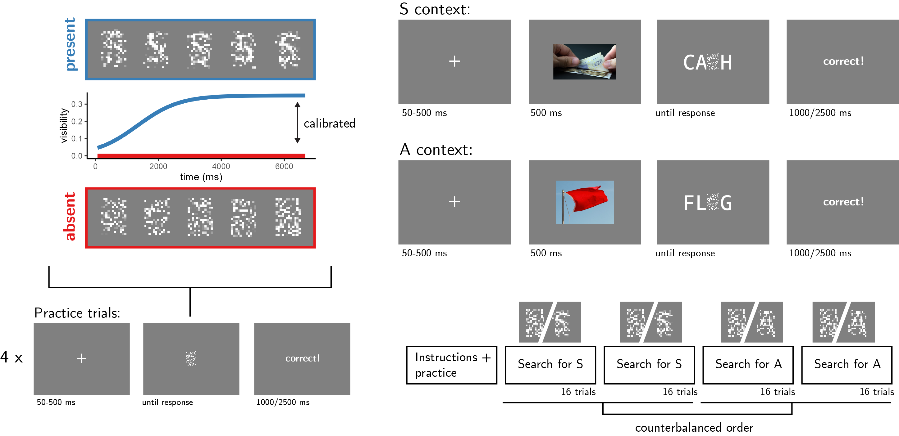
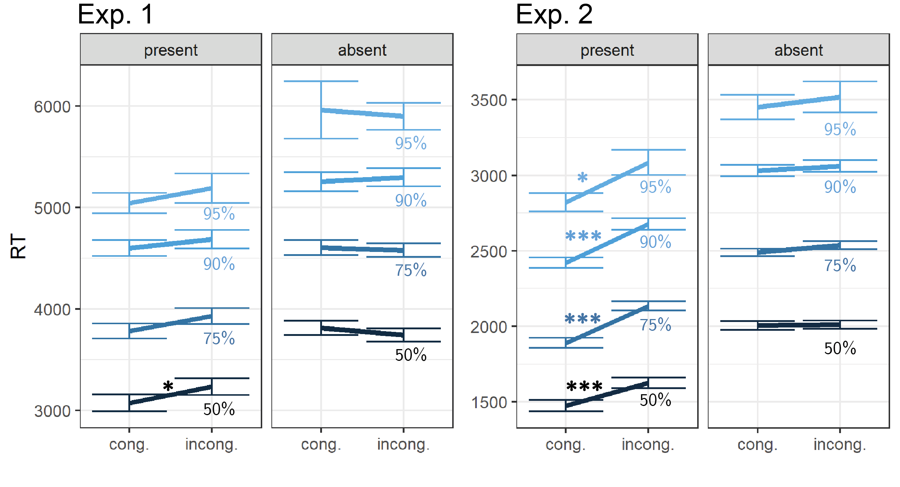
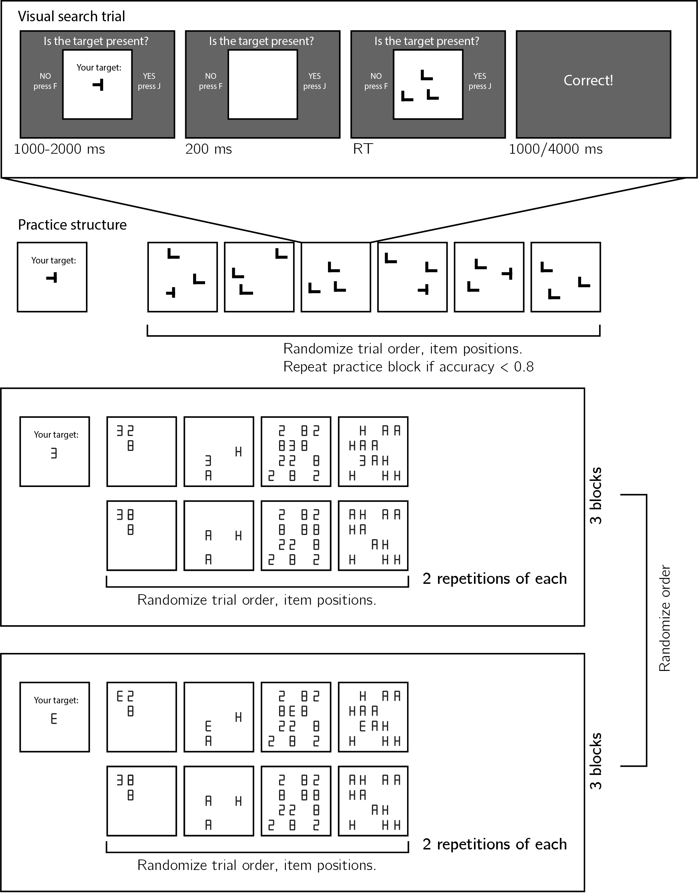
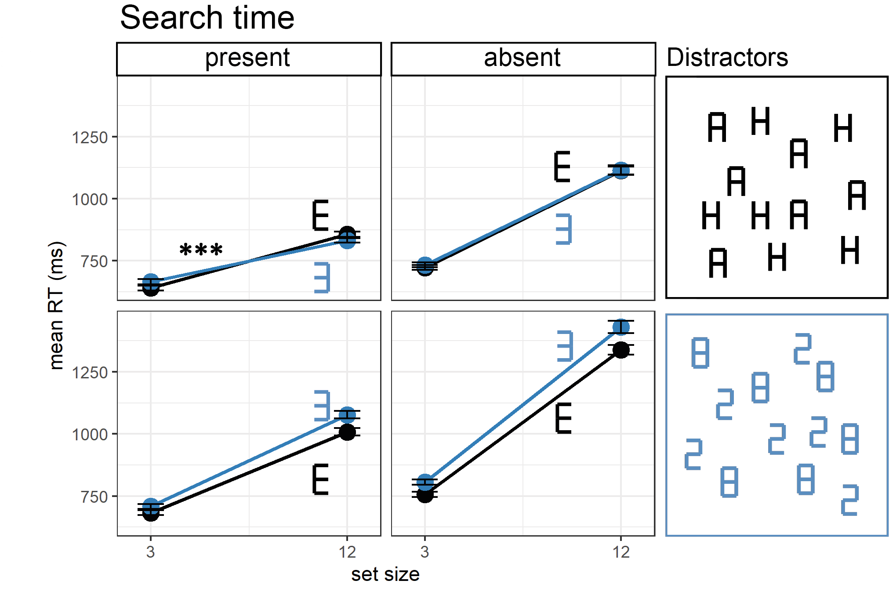

# Introduction

After checking Taylor Swift's Wikipedia page, we are confident that she hasn't announced her retirement from music. If she had, it would have been mentioned on her page. We also checked Russian cellist Natalia Gutman's page and didn't see any mention of a similar announcement, but we are not so sure she hasn't made one since her Wikipedia page only gets updated irregularly. The absence of evidence on Wikipedia is enough to make a solid inference in the case of Swift but not in the case of Gutman because we know that information about Swift spreads more efficiently on the internet.

This paper discusses how we make inferences based on the absence of evidence in visual perception. Such inferences about the negation of a hypothesis ($H$) depend on our belief in the probability that we would observe evidence ($E$) if $H$ were true ($p(E|H)$) [@walton1992nonfallacious; @walton2010arguments; @oaksford2004bayesian]. In other words, we believe that something is not true (for example, that Taylor Swift hasn't announced her retirement from music) when we believe that "if it were true, we would have heard about it by now" [@goldberg2011if]. 

Here we examine how people apply a similar reasoning in the domain of visual perception. Simply not perceiving something doesn't mean that it's not there. We also need to be certain that we would have perceived it if it were present. As a result, the timing of decisions about absence provides valuable insight into people's implicit beliefs about their perception and attention. Rapid decisions about absence reflect a belief that presence would have been detected quickly and easily, while slow decisions reflect a belief that presence would have taken longer to detect [@mazor2021inference; @mazor2022efficient].

To contrast cases in which perception is fast versus slow, we make use of a robust finding in visual cognition: our perception of objects is affected by context. For example, we perceive objects better in their natural surroundings [@rossel2022makes] and we perceive letters better as part of a word [@heilbron2020word]. In this study, we're not focusing on how well participants can perceive objects, but on how quickly they can infer their absence when they're not there. For example, if people believe that objects are easier to perceive in their natural context, this should affect the timing of their decisions about absence: they should be able to quickly decide that an object is missing in a context that allows for speedy perception. But if they are not aware of these context effects, speedy detection will not translate to speedy inference about absence. 

We tested context effects on decisions about absence in two settings: a near-threshold detection setting, where perception is better in matching, congruent contexts, and a visual search setting where target detection is facilitated in non-matching, or incongruent contexts. In both cases we find that subjects fail to properly adjust the timing of their decisions about absence, revealing no insight into context effects on perception. 


```{r setup, include = FALSE}
library("papaja")
r_refs("r-references.bib")
library('reticulate')
library('tidyverse')
library('broom')
library('cowplot')
library('MESS') # for AUCs
library('lsr') # for effect sizes
library('pwr') # for power calculations
library('brms') # for mixed effects modeling
library('BayesFactor') # for Bayesian t test
library('jsonlite') #parsing data from sort_trial
library('afex') #for anova

```

```{python, include=FALSE, eval=FALSE}
import json
import pandas as pd
import numpy as np
from os import path as path

def to_csv(filename):
    dfs=[]
    with open(filename+'.txt') as json_file:
        for i,line in enumerate(json_file):
            if line[0:14]!='Consent given.':
                dfs.append(pd.read_json(line))


    group_df = pd.concat(dfs)
    group_df.to_csv(filename+'.csv', index=False)
    return(group_df)

# group_df = to_csv(path.join('..','experiments','pilots','letters','data','jatos_results_batch1'))
# group_df[group_df.trial_type=='survey-text'].responses

```


# Exp. 1

We report how we determined our sample size, all data exclusions (if any), all manipulations, and all measures in the study. 

## Participants

The research complied with all relevant ethical regulations, and was approved by the Research Ethics Committee of Birkbeck, University of London (study ID number 1812000). In all experiments, participants were recruited via Prolific, and gave informed consent prior to their participation. To be eligible to take part, their Prolific approval rate had to be 95% or higher, their reported first language English, and their age between 18 and 60. We collected data until we reached 100 included participants (after applying our pre-registered exclusion criteria). The entire experiment took 11 minutes to complete. Participants were paid £1.38 for their participation, equivalent to an hourly wage of £7.50.

## Procedure

Participants detected the presence or absence of a target letter (S or A, in different blocks) in a patch of dynamic grayscale noise presented at 15 frames per second. In each frame, noise was generated by randomly sampling grayscale values from a target image $I$. Specifically, for each pixel $S_{ij}$, we displayed the grayscale value for the corresponding pixel in the original image $I_{ij}$ with some probability $p$, and the grayscale value of a randomly chosen pixel $I_{i'j'}$ with probability $1-p$. On target-absent trials, $p$ was set to $0$, such that grayscale values of all pixels were randomly shuffled, with replacement. On target-present trials, the probability $p$ slowly increased as the trial progressed, according to the formula $p=\frac{v}{1+e^{-0.05(n-40)))}}$ with $n$ representing the frame number, and $v$ the maximum visibility level (see Fig. \@ref(fig:design)). $v$ was calibrated online to achieve performance levels of around 80%, following a 1-up-3-down procedure, starting at $v=0.35$ and following a multiplicative set size of $0.9$, which moved closer to 1 following each change direction in the calibration process. Responses were delivered using the F and G keyboard keys (counterbalancing response mapping across subjects).

```{r design, echo=FALSE, fig.cap="Experimental design. Top left: target visibility as a function of frame number for in target present (blue) and target absent (red) trials. Bottom left: trial structure in practice trials. Top right: trial structure in the main blocks of the experiment, in S- and A- context trials. Bottom right: overall experiment structure. ", out.width = '75%'}

```

After reading the instructions, participants completed four practice trials. In case their accuracy in these four practice trials fell below 3/4, they were reminded of task instructions and given additional practice trials, until reaching the desired accuracy level. Otherwise, they continued to the main part of the experiment. Here, their task was exactly the same, but the noise patch was embedded in a congruent or incongruent context word. For example, when searching for the letter S, the context word CA_H (cash) is congruent but the context word FL_G (flag) is not (see Fig. \@ref(fig:design), upper right panel). To make sure participants are primed with the correct reading of the context word, an image of its meaning was presented for 500 ms following the fixation cross and prior to the presentation of the noise display. Participants were instructed to ignore the image and surrounding letters, and focus on the central stimuli. 

The main part of the experiment comprised four blocks of 16 trials. For approximately half of the participants, in blocks 1 and 2 the target letter was S and in blocks 3 and 4 it was A. The order of letters was reversed for the other half. All context words were presented twice: once when detecting the letter S and once when detecting the letter A. As a result, all context words were presented both as congruent and as incongruent contexts for the target letter. Overall, there were 32 context words: 16 where the missing letter is an A and 16 where it is an S. All words were 4- or 5-letter nouns with S or A in one of the central positions (i.e., position 2 or 3 in 4-letter words and position 3 in 5-letter words). 

### Randomization

The order and timing of experimental events was determined pseudo-randomly by the Mersenne Twister pseudorandom number generator, initialized in a way that ensures registration time-locking [@mazor2018novel]. 

## Results

We used `r cite_r(file = "r-references.bib", pkgs = c("dplyr", "ggplot2", "tidyverse","papaja","broom"), withhold = FALSE)` for all our analyses. 

```{r load_and_format_data, echo=FALSE, cache=TRUE}
E1.raw_df <- read_csv('../experiments/letters/data/jatos_resultfiles_batch1/all_data.csv') %>%
  mutate(subj_id=PROLIFIC_PID,
         correct = as.numeric(correct),
         RT = as.numeric(RT),
         present=as.numeric(present),
         resp = response==presence_key,
         context=ifelse(context_string=='M SK','A',context))

pilot.export.df <- read_csv('../experiments/pilots/letters/data/prolific_export_batch2.csv');

E2.raw_df <- read_csv('../experiments/letters2/data/jatos_resultfiles_batch1/all_data.csv') %>%
  mutate(subj_id=PROLIFIC_PID,
         correct = as.numeric(correct),
         RT = as.numeric(RT),
         present=as.numeric(present),
         resp = response==presence_key,
         context=ifelse(context_string=='M SK','A',context)) #I accidentally coded this as S
```

```{r exclusion, echo=FALSE, cache=TRUE}

E1.low_accuracy <- E1.raw_df %>%
  filter(test_part=='test1' | test_part=='test2') %>%
  group_by(subj_id) %>%
  summarise(
    accuracy = mean(correct)) %>%
    filter(accuracy<0.5) %>%
  pull(subj_id)

E1.too_slow <- E1.raw_df %>%
  filter(test_part=='test1' | test_part=='test2') %>%
  group_by(subj_id, test_part) %>%
  summarise(
    third_quartile_RT = quantile(RT,0.75)) %>%
    filter(third_quartile_RT>5000) %>%
  pull(subj_id)

E1.too_fast <- E1.raw_df %>%
  filter(test_part=='test1' | test_part=='test2') %>%
  group_by(subj_id, test_part) %>%
  summarise(
    first_quartile_RT = quantile(RT,0.25)) %>%
    filter(first_quartile_RT<100) %>%
  pull(subj_id)

E1.to_exclude <- c(
  E1.low_accuracy,
  E1.too_slow,
  E1.too_fast
) %>% unique()


E1.df <- E1.raw_df %>%
  filter(!(subj_id %in% E1.to_exclude));

E2.low_accuracy <- E2.raw_df %>%
  filter(test_part=='test1' | test_part=='test2') %>%
  group_by(subj_id) %>%
  summarise(
    accuracy = mean(correct)) %>%
    filter(accuracy<0.5) %>%
  pull(subj_id)

E2.too_slow <- E2.raw_df %>%
  filter(test_part=='test1' | test_part=='test2') %>%
  group_by(subj_id) %>%
  summarise(
    third_quartile_RT = quantile(RT,0.75)) %>%
    filter(third_quartile_RT>5000) %>%
  pull(subj_id)

E2.too_fast <- E2.raw_df %>%
  filter(test_part=='test1' | test_part=='test2') %>%
  group_by(subj_id) %>%
  summarise(
    first_quartile_RT = quantile(RT,0.25)) %>%
    filter(first_quartile_RT<100) %>%
  pull(subj_id)

E2.to_exclude <- c(
  E2.low_accuracy,
  E2.too_slow,
  E2.too_fast
) %>% unique()

E2.df <- E2.raw_df %>%
  filter(!(subj_id %in% E2.to_exclude));

```


```{r plot_visibility_per_frame, echo=FALSE, cache=TRUE}


frame_number = seq(100);
time = 1000*frame_number/15;
n=20;
p=0.35;
steepness = 0.1
vis = p/(1+exp(-steepness*(frame_number-n)));

df <- data.frame(frame_number,time,vis) %>%
    mutate(absent = 0,
           present = vis) %>% 
  gather(condition,vis, absent:present) %>%
  mutate(condition= factor(condition,levels=c('present','absent')))

p <- df %>% 
  ggplot(aes(x=time,y=vis, color=condition)) + 
  geom_line(size=2) + 
  theme_classic() + 
  labs(x='time (ms)', y='visibility') +
  scale_color_manual(values=c("#377eb8", "#e41a1c"))+
  theme(legend.position = "none");

ggsave('figures/visibility.png',p,width=4,height=1.5)


```

```{r descriptives, echo=FALSE, cache=TRUE}

E1.overall_descriptives <- E1.df %>%
    filter(test_part=='test1' | test_part=='test2') %>%
    group_by(subj_id) %>%
    summarise(accuracy=mean(correct),
            resp_bias=mean(resp),
            slow_RT = quantile(RT,0.75)>5000,
            RT=median(RT),
            hit_rate = (sum(correct & present)+0.5)/(sum(present)+1),
            fa_rate = (sum(!correct & !present)+0.5)/(sum(!present)+1),
            d = qnorm(hit_rate)-qnorm(fa_rate),
            c = -0.5*(qnorm(hit_rate)+qnorm(fa_rate)));

E2.overall_descriptives <- E2.df %>%
    filter(test_part=='test1' | test_part=='test2') %>%
    group_by(subj_id) %>%
    summarise(accuracy=mean(correct),
            resp_bias=mean(resp),
            slow_RT = quantile(RT,0.75)>5000,
            RT=median(RT),
            hit_rate = (sum(correct & present)+0.5)/(sum(present)+1),
            fa_rate = (sum(!correct & !present)+0.5)/(sum(!present)+1),
            d = qnorm(hit_rate)-qnorm(fa_rate),
            c = -0.5*(qnorm(hit_rate)+qnorm(fa_rate)));
```

`r E1.raw_df%>%pull(subj_id)%>%unique()%>%length()` participants completed the task. Mean accuracy in the main block experiment was `r E1.overall_descriptives%>%pull(accuracy)%>%mean()` (SD=`r E1.overall_descriptives%>%pull(accuracy)%>%sd()`). The mean median response time was `r printnum(E1.overall_descriptives%>%pull(RT)%>%mean()/1000)` seconds (SD=`r printnum(E1.overall_descriptives%>%pull(RT)%>%sd()/1000)`). No participants were excluded based on our pre-registered accuracy lower bound of 50%, and based on our pre-registered criterion for making hasty responses (RT<100 ms in more than 25% of the trials). We also pre-registered a plan to exclude participants with extremely slow reaction times (above 5 seconds in more than 25% of the trials), and to exclude trials with response times above 5 seconds. However, slower than expected responses meant that our pre-registered response-time dependent exclusion criteria were unfit to the data: excluding participants with more than 25% of trials slower than 5 seconds meant excluding `r E1.too_slow%>%length()` of our `r E1.raw_df%>%pull(subj_id)%>%unique()%>%length()` participants and biasing our sample. We therefore decided to revise our plan and to include participants and trials with slow responses. 


```{r H1, echo=FALSE, cache=TRUE}

E1.RT_by_resp <- E1.df %>%
  filter((test_part=='test1' | test_part=='test2') & RT>100) %>%
  group_by(subj_id,resp) %>%
  summarise(RT=median(RT))%>%
  spread(resp,RT,sep='')%>%
  mutate(diff=respTRUE-respFALSE)

E2.RT_by_resp <- E2.df %>%
  filter((test_part=='test1' | test_part=='test2') & RT>100) %>%
  group_by(subj_id,resp) %>%
  summarise(RT=median(RT))%>%
  spread(resp,RT,sep='')%>%
  mutate(diff=respTRUE-respFALSE)
```

```{r H2, echo=FALSE, cache=TRUE}

E1.RT_by_context_in_presence <- E1.df %>%
  filter((test_part=='test1' | test_part=='test2') & RT>100 & resp) %>%
  mutate(cong = target==context)%>%
  group_by(subj_id,cong) %>%
  summarise(RT=median(RT))%>%
  spread(cong,RT,sep='')%>%
  mutate(diff=congTRUE-congFALSE);

E1.RT_by_context_in_presence_correct_only <- E1.df %>%
  filter((test_part=='test1' | test_part=='test2') & RT>100 & resp & correct) %>%
  mutate(cong = target==context)%>%
  group_by(subj_id,cong) %>%
  summarise(RT=median(RT))%>%
  spread(cong,RT,sep='')%>%
  mutate(diff=congTRUE-congFALSE)

E1.RT_by_context_in_presence_incorrect_only <- E1.df %>%
  filter((test_part=='test1' | test_part=='test2') & RT>100 & resp & !correct) %>%
  mutate(cong = target==context)%>%
  group_by(subj_id,cong) %>%
  summarise(RT=median(RT))%>%
  spread(cong,RT,sep='')%>%
  mutate(diff=congTRUE-congFALSE)

E1.RT_by_context_in_presence_S_only <- E1.df %>%
  filter((test_part=='test1' | test_part=='test2') & RT>100 & resp & target=='S') %>%
  mutate(cong = target==context)%>%
  group_by(subj_id,cong) %>%
  summarise(RT=median(RT))%>%
  spread(cong,RT,sep='')%>%
  mutate(diff=congTRUE-congFALSE)

E1.RT_by_context_in_presence_A_only <- E1.df %>%
  filter((test_part=='test1' | test_part=='test2') & RT>100 & resp & target=='A') %>%
  mutate(cong = target==context)%>%
  group_by(subj_id,cong) %>%
  summarise(RT=median(RT))%>%
  spread(cong,RT,sep='')%>%
  mutate(diff=congTRUE-congFALSE)

E2.RT_by_context_in_presence <- E2.df %>%
  filter((test_part=='test1' | test_part=='test2') & RT>100 & resp) %>%
  mutate(cong = target==context)%>%
  group_by(subj_id,cong) %>%
  summarise(RT=median(RT))%>%
  spread(cong,RT,sep='')%>%
  mutate(diff=congTRUE-congFALSE);

E2.RT_by_context_in_presence_correct_only <- E2.df %>%
  filter((test_part=='test1' | test_part=='test2') & RT>100 & resp & correct) %>%
  mutate(cong = target==context)%>%
  group_by(subj_id,cong) %>%
  summarise(RT=median(RT))%>%
  spread(cong,RT,sep='')%>%
  mutate(diff=congTRUE-congFALSE)

E2.RT_by_context_in_presence_incorrect_only <- E2.df %>%
  filter((test_part=='test1' | test_part=='test2') & RT>100 & resp & !correct) %>%
  mutate(cong = target==context)%>%
  group_by(subj_id,cong) %>%
  summarise(RT=median(RT))%>%
  spread(cong,RT,sep='')%>%
  mutate(diff=congTRUE-congFALSE)

E2.RT_by_context_in_presence_S_only <- E2.df %>%
  filter((test_part=='test1' | test_part=='test2') & RT>100 & resp & target=='S') %>%
  mutate(cong = target==context)%>%
  group_by(subj_id,cong) %>%
  summarise(RT=median(RT))%>%
  spread(cong,RT,sep='')%>%
  mutate(diff=congTRUE-congFALSE)

E2.RT_by_context_in_presence_A_only <- E2.df %>%
  filter((test_part=='test1' | test_part=='test2') & RT>100 & resp & target=='A') %>%
  mutate(cong = target==context)%>%
  group_by(subj_id,cong) %>%
  summarise(RT=median(RT))%>%
  spread(cong,RT,sep='')%>%
  mutate(diff=congTRUE-congFALSE)

E2.RT_by_context_in_presence_part1_only <- E2.df %>%
  filter(test_part=='test1'  & RT>100 & resp) %>%
  mutate(cong = target==context)%>%
  group_by(subj_id,cong) %>%
  summarise(RT=median(RT))%>%
  spread(cong,RT,sep='')%>%
  mutate(diff=congTRUE-congFALSE)

E2.RT_by_context_in_presence_part2_only <- E2.df %>%
  filter(test_part=='test2' & RT>100 & resp ) %>%
  mutate(cong = target==context)%>%
  group_by(subj_id,cong) %>%
  summarise(RT=median(RT))%>%
  spread(cong,RT,sep='')%>%
  mutate(diff=congTRUE-congFALSE)
```

Since decisions about absence are reached only when the subject can be confident that presence would have been detected, they are commonly slower than decisions about presence [@mazor2021stage]. Indeed, response times were significantly shorter in decisions about presence compared to absence (pre-registered Hypothesis 1: `r printnum(E1.RT_by_resp%>%pull(respTRUE)%>%mean()/1000)` vs `r printnum(E1.RT_by_resp%>%pull(respFALSE)%>%mean()/1000)` seconds; `r apa_print(E1.RT_by_resp%>%pull(diff)%>%t.test())$statistic`). 

Turning to context effects on detection, target-present decisions were significantly faster when the target letter appeared in a congruent compared to an incongruent context (pre-registered Hypothesis 2: `r printnum(E1.RT_by_context_in_presence%>%pull(congTRUE)%>%mean()/1000)` vs `r printnum(E1.RT_by_context_in_presence%>%pull(congFALSE)%>%mean()/1000)` seconds; `r apa_print(E1.RT_by_context_in_presence%>%pull(diff)%>%t.test())$statistic`). This was also the case when restricting the analysis to correct responses only (`r printnum(E1.RT_by_context_in_presence_correct_only%>%pull(congTRUE)%>%mean()/1000)` vs `r printnum(E1.RT_by_context_in_presence_correct_only%>%pull(congFALSE)%>%mean()/1000)` seconds; `r apa_print(E1.RT_by_context_in_presence_correct_only%>%pull(diff)%>%t.test())$statistic`). This finding is consistent with previous reports of sensory sharpening effects of context congruency [@rossel2022makes; @heilbron2020word].


```{r H3, echo=FALSE, cache=TRUE}

E1.RT_by_context_in_absence <- E1.df %>%
  filter((test_part=='test1' | test_part=='test2') & RT>100 & !resp) %>%
  mutate(cong = target==context)%>%
  group_by(subj_id,cong) %>%
  summarise(RT=median(RT))%>%
  spread(cong,RT,sep='')%>%
  mutate(diff=congTRUE-congFALSE);

E1.RT_by_context_in_absence_correct_only <- E1.df %>%
  filter((test_part=='test1' | test_part=='test2') & RT>100 & !resp & correct) %>%
  mutate(cong = target==context)%>%
  group_by(subj_id,cong) %>%
  summarise(RT=median(RT))%>%
  spread(cong,RT,sep='')%>%
  mutate(diff=congTRUE-congFALSE)

E1.RT_by_context_in_absence_incorrect_only <- E1.df %>%
  filter((test_part=='test1' | test_part=='test2') & RT>100 & !resp & !correct) %>%
  mutate(cong = target==context)%>%
  group_by(subj_id,cong) %>%
  summarise(RT=median(RT))%>%
  spread(cong,RT,sep='')%>%
  mutate(diff=congTRUE-congFALSE)

E2.RT_by_context_in_absence <- E2.df %>%
  filter((test_part=='test1' | test_part=='test2') & RT>100 & !resp) %>%
  mutate(cong = target==context)%>%
  group_by(subj_id,cong) %>%
  summarise(RT=median(RT))%>%
  spread(cong,RT,sep='')%>%
  mutate(diff=congTRUE-congFALSE);

E2.RT_by_context_in_absence_correct_only <- E2.df %>%
  filter((test_part=='test1' | test_part=='test2') & RT>100 & !resp & correct) %>%
  mutate(cong = target==context)%>%
  group_by(subj_id,cong) %>%
  summarise(RT=median(RT))%>%
  spread(cong,RT,sep='')%>%
  mutate(diff=congTRUE-congFALSE)

E2.RT_by_context_in_absence_incorrect_only <- E2.df %>%
  filter((test_part=='test1' | test_part=='test2') & RT>100 & !resp & !correct) %>%
  mutate(cong = target==context)%>%
  group_by(subj_id,cong) %>%
  summarise(RT=median(RT))%>%
  spread(cong,RT,sep='')%>%
  mutate(diff=congTRUE-congFALSE)

E2.RT_by_context_in_absence_S_only <- E2.df %>%
  filter((test_part=='test1' | test_part=='test2') & RT>100 & !resp & target=='S') %>%
  mutate(cong = target==context)%>%
  group_by(subj_id,cong) %>%
  summarise(RT=median(RT))%>%
  spread(cong,RT,sep='')%>%
  mutate(diff=congTRUE-congFALSE)

E2.RT_by_context_in_absence_A_only <- E2.df %>%
  filter((test_part=='test1' | test_part=='test2') & RT>100 & !resp & target=='A') %>%
  mutate(cong = target==context)%>%
  group_by(subj_id,cong) %>%
  summarise(RT=median(RT))%>%
  spread(cong,RT,sep='')%>%
  mutate(diff=congTRUE-congFALSE)

E2.RT_by_context_in_absence_part1_only <- E2.df %>%
  filter(test_part=='test1'  & RT>100 & !resp ) %>%
  mutate(cong = target==context)%>%
  group_by(subj_id,cong) %>%
  summarise(RT=median(RT))%>%
  spread(cong,RT,sep='')%>%
  mutate(diff=congTRUE-congFALSE)

E2.RT_by_context_in_absence_part2_only <- E2.df %>%
  filter(test_part=='test2' & RT>100 & !resp ) %>%
  mutate(cong = target==context)%>%
  group_by(subj_id,cong) %>%
  summarise(RT=median(RT))%>%
  spread(cong,RT,sep='')%>%
  mutate(diff=congTRUE-congFALSE)
```


```{r H4, echo=FALSE, cache=TRUE}

E1.RT_by_context_and_response <- merge(
  E1.RT_by_context_in_presence,
  E1.RT_by_context_in_absence,
  by= 'subj_id',
  suffixes = c('presence','absence')) %>%
  mutate(interaction = diffpresence-diffabsence);

E1.RT_by_context_and_response_correct_only <- merge(
  E1.RT_by_context_in_presence_correct_only,
  E1.RT_by_context_in_absence_correct_only,
  by= 'subj_id',
  suffixes = c('presence','absence')) %>%
  mutate(interaction = diffpresence-diffabsence);

E2.RT_by_context_and_response <- merge(
  E2.RT_by_context_in_presence,
  E2.RT_by_context_in_absence,
  by= 'subj_id',
  suffixes = c('presence','absence')) %>%
  mutate(interaction = diffpresence-diffabsence);

E2.RT_by_context_and_response_correct_only <- merge(
  E2.RT_by_context_in_presence_correct_only,
  E2.RT_by_context_in_absence_correct_only,
  by= 'subj_id',
  suffixes = c('presence','absence')) %>%
  mutate(interaction = diffpresence-diffabsence);

E2.RT_by_context_and_response_S_only <- merge(
  E2.RT_by_context_in_presence_S_only,
  E2.RT_by_context_in_absence_S_only,
  by= 'subj_id',
  suffixes = c('presence','absence')) %>%
  mutate(interaction = diffpresence-diffabsence);

E2.RT_by_context_and_response_A_only <- merge(
  E2.RT_by_context_in_presence_A_only,
  E2.RT_by_context_in_absence_A_only,
  by= 'subj_id',
  suffixes = c('presence','absence')) %>%
  mutate(interaction = diffpresence-diffabsence);

E2.RT_by_context_and_response_part1_only <- merge(
  E2.RT_by_context_in_presence_part1_only,
  E2.RT_by_context_in_absence_part1_only,
  by= 'subj_id',
  suffixes = c('presence','absence')) %>%
  mutate(interaction = diffpresence-diffabsence);

E2.RT_by_context_and_response_part2_only <- merge(
  E2.RT_by_context_in_presence_part2_only,
  E2.RT_by_context_in_absence_part2_only,
  by= 'subj_id',
  suffixes = c('presence','absence')) %>%
  mutate(interaction = diffpresence-diffabsence);
```

Critically, and in contrast to decisions about presence, the timing of decisions about absence was similar when the target letter was missing from a congruent or incongruent context (pre-registered Hypothesis 3: `r printnum(E1.RT_by_context_in_absence%>%pull(congTRUE)%>%mean()/1000)` vs `r printnum(E1.RT_by_context_in_absence%>%pull(congFALSE)%>%mean()/1000)` seconds; `r apa_print(E1.RT_by_context_in_absence%>%pull(diff)%>%t.test())$statistic`). Similarly, we found no effect of context on RT in decisions about absence also when restricting our analysis to correct trials only (`r apa_print(E1.RT_by_context_in_absence_correct_only%>%pull(diff)%>%t.test())$statistic`). Furthermore, the effect of context congruency on response time was stronger in decisions about target presence, compared to decisions about target absence (pre-registered Hypothesis 4: `r apa_print(E1.RT_by_context_and_response%>%pull(interaction)%>%t.test())$statistic`), also when restricting the analysis to correct responses only (`r apa_print(E1.RT_by_context_and_response_correct_only%>%pull(interaction)%>%t.test())$statistic`).

(ref:Exp12) Reaction time results, Exp. 1 and 2. Showing the mean subject-wise estimate of the 50%, 75%, 90% and 9% RT quantiles, as a function of target-context congruency and target presence. Correct responses only. Error bars represent the standard error of congruency effects, removing inter-subject variability. \*: p<0.05, \*\*: p<0.01, \*\*\*: p<0.001

```{r Exp12results, echo=FALSE, fig.cap="(ref:Exp12)", out.width = '75%'}

```

```{r SDT, echo=FALSE, cache=TRUE}

E1.descriptives_by_context<- E1.df %>%
  filter(test_part=='test1' | test_part=='test2') %>%
  mutate(cong = target==context,
         resp = response==presence_key)%>%
  group_by(subj_id,cong) %>%
  summarise(accuracy=mean(correct),
            resp_bias=mean(resp),
            RT=median(RT),
            hit_rate = (sum(correct & present)+0.5)/(sum(present)+1),
            fa_rate = (sum(!correct & !present)+0.5)/(sum(!present)+1),
            d = qnorm(hit_rate)-qnorm(fa_rate),
            c = -0.5*(qnorm(hit_rate)+qnorm(fa_rate)))

E2.descriptives_by_context<- E2.df %>%
  filter(test_part=='test1' | test_part=='test2') %>%
  mutate(cong = target==context,
         resp = response==presence_key)%>%
  group_by(subj_id,cong) %>%
  summarise(accuracy=mean(correct),
            resp_bias=mean(resp),
            RT=median(RT),
            hit_rate = (sum(correct & present)+0.5)/(sum(present)+1),
            fa_rate = (sum(!correct & !present)+0.5)/(sum(!present)+1),
            d = qnorm(hit_rate)-qnorm(fa_rate),
            c = -0.5*(qnorm(hit_rate)+qnorm(fa_rate)))
```
Consistent with a sensory sharpening effect, signal detection sensitivity was significantly higher in congruent contexts (pre-registered Hypothesis 5: `r apa_print(E1.descriptives_by_context %>%select(subj_id,cong,d)%>%spread(cong,d,sep='')%>%mutate(diff=congTRUE-congFALSE)%>%pull(diff)%>%t.test)$statistic`), with `r E1.descriptives_by_context %>%filter(cong)%>%pull(d)%>%mean() %>%printnum()` (SD=`r E1.descriptives_by_context %>%filter(cong)%>%pull(d)%>%sd()%>%printnum()`) when the context matched the target letter, and `r E1.descriptives_by_context %>%filter(!cong)%>%pull(d)%>%mean() %>%printnum()` (SD=`r E1.descriptives_by_context %>%filter(!cong)%>%pull(d)%>%sd()%>%printnum()`) when it did not match the target letter. This effect was driven by an increase in hit rate (`r apa_print(E1.descriptives_by_context %>%select(subj_id,cong,hit_rate)%>%spread(cong,hit_rate,sep='')%>%mutate(diff=congTRUE-congFALSE)%>%pull(diff)%>%t.test)$statistic`), without an effect on the false-positive rate (`r apa_print(E1.descriptives_by_context %>%select(subj_id,cong,fa_rate)%>%spread(cong,fa_rate,sep='')%>%mutate(diff=congTRUE-congFALSE)%>%pull(diff)%>%t.test)$statistic`).

The signal detection criterion was overall positive, indicating that participants were conservative in their responses. We found no significant difference in decision criterion between congruent (`r E1.descriptives_by_context %>%filter(cong)%>%pull(c)%>%mean() %>%printnum()`; SD=`r E1.descriptives_by_context %>%filter(cong)%>%pull(c)%>%sd()%>%printnum()`) and incongruent (`r E1.descriptives_by_context %>%filter(!cong)%>%pull(c)%>%mean() %>%printnum()`; SD=`r E1.descriptives_by_context %>%filter(!cong)%>%pull(c)%>%sd()%>%printnum()`) contexts (pre-registered Hypothesis 6: `r apa_print(E1.descriptives_by_context %>%select(subj_id,cong,c)%>%spread(cong,c,sep='')%>%mutate(diff=congTRUE-congFALSE)%>%pull(diff)%>%t.test)$statistic`).

# Exp. 2: immediate appearance

We were concerned that subjects' failure to incorporate context information into decisions about absence in Exp. 1 was driven in part by the gradual appearance of the target letter. The time scale in which the letter emerged (seconds), may have been too slow relative to the effects of contexts on perception (tens of milliseconds). In Exp. 2, we used a similar paradigm but had the letters appear immediately on target-present trials, together with the context letters. We also increased our sample size, given effect size estimates from Exp. 1. 

## Participants

We collected data from `r E2.raw_df%>%pull(subj_id)%>%unique()%>%length()` Prolific participants until we reached 300 included participants, applying our pre-registered exclusion criteria. `r E2.to_exclude%>%length()` participants were excluded based on our pre-registered accuracy and RT-based exclusion criteria. The entire experiment took 11 minutes to complete. Participants were paid £1.38 for their participation, equivalent to an hourly wage of £7.50.

## Procedure

Exp. 2 was identical to Exp. 1, except two changes. Most importantly, instead of emerging gradually, the visibility of the target letter $p$ remained constant throughout target-present trials. Second, the calibration step size was reset to $0.9$ after the second block to allow separate staircasing for each letter.

## results


Overall, in Exp. 2 we successfully replicated the main results of Exp. 1: subjects were faster to detect the presence of a target letter in a congruent context, but this context effect did not extend to decisions about absence. 

Mean accuracy in the main experiment was `r E2.overall_descriptives%>%pull(accuracy)%>%mean()%>%printnum()` (SD=`r E2.overall_descriptives%>%pull(accuracy)%>%sd()%>%printnum()`). The mean median response time was `r printnum(E2.overall_descriptives%>%pull(RT)%>%mean()/1000)` seconds (SD=`r printnum(E2.overall_descriptives%>%pull(RT)%>%sd()/1000)`).  Similar to Exp. 1, response times were significantly shorter in decisions about presence compared to absence (pre-registered Hypothesis 1: `r printnum(E2.RT_by_resp%>%pull(respTRUE)%>%mean()/1000)` vs `r printnum(E2.RT_by_resp%>%pull(respFALSE)%>%mean()/1000)` seconds; `r apa_print(E2.RT_by_resp%>%pull(diff)%>%t.test())$statistic`). 

Target-present decisions were again faster when the target letter appeared in a congruent context, consistent with sensory sharpening (pre-registered Hypothesis 2: `r printnum(E2.RT_by_context_in_presence%>%pull(congTRUE)%>%mean()/1000)` vs `r printnum(E2.RT_by_context_in_presence%>%pull(congFALSE)%>%mean()/1000)` seconds; `r apa_print(E2.RT_by_context_in_presence%>%pull(diff)%>%t.test())$statistic`). This was also the case when restricting the analysis to correct responses (`r printnum(E2.RT_by_context_in_presence_correct_only%>%pull(congTRUE)%>%mean()/1000)` vs `r printnum(E2.RT_by_context_in_presence_correct_only%>%pull(congFALSE)%>%mean()/1000)` seconds; `r apa_print(E2.RT_by_context_in_presence_correct_only%>%pull(diff)%>%t.test())$statistic`). 

Replicating Exp. 1, the timing of decisions about absence was unaffected by the context manipulation (pre-registered Hypothesis 3: `r printnum(E2.RT_by_context_in_absence%>%pull(congTRUE)%>%mean()/1000)` vs `r printnum(E2.RT_by_context_in_absence%>%pull(congFALSE)%>%mean()/1000)` seconds; `r apa_print(E2.RT_by_context_in_absence%>%pull(diff)%>%t.test())$statistic`), also when restricting our analysis to correct trials only (`r apa_print(E2.RT_by_context_in_absence_correct_only%>%pull(diff)%>%t.test())$statistic`). Most importantly, the effect of context congruency on response time was stronger in decisions about target presence, compared to decisions about target absence (pre-registered Hypothesis 4: `r apa_print(E2.RT_by_context_and_response%>%pull(interaction)%>%t.test())$statistic`), even when restricting the analysis to correct responses only (`r apa_print(E2.RT_by_context_and_response_correct_only%>%pull(interaction)%>%t.test())$statistic`).

Turning to accuracy and bias measures, sensitivity was significantly higher in congruent contexts (pre-registered Hypothesis 5: `r E2.descriptives_by_context %>%filter(cong)%>%pull(d)%>%mean() %>%printnum()` versus `r E2.descriptives_by_context %>%filter(!cong)%>%pull(d)%>%mean() %>%printnum()`; `r apa_print(E2.descriptives_by_context %>%select(subj_id,cong,d)%>%spread(cong,d,sep='')%>%mutate(diff=congTRUE-congFALSE)%>%pull(diff)%>%t.test)$statistic`).  This effect was driven by an increase in hit rate (`r apa_print(E2.descriptives_by_context %>%select(subj_id,cong,hit_rate)%>%spread(cong,hit_rate,sep='')%>%mutate(diff=congTRUE-congFALSE)%>%pull(diff)%>%t.test)$statistic`), without an effect on the false-positive rate (`r apa_print(E2.descriptives_by_context %>%select(subj_id,cong,fa_rate)%>%spread(cong,fa_rate,sep='')%>%mutate(diff=congTRUE-congFALSE)%>%pull(diff)%>%t.test)$statistic`).

Finally, the signal detection criterion was overall positive and lower in congruent (`r E2.descriptives_by_context %>%filter(cong)%>%pull(c)%>%mean() %>%printnum()`; SD=`r E2.descriptives_by_context %>%filter(cong)%>%pull(c)%>%sd()%>%printnum()`) than in incongruent (`r E2.descriptives_by_context %>%filter(!cong)%>%pull(c)%>%mean() %>%printnum()`; SD=`r E2.descriptives_by_context %>%filter(!cong)%>%pull(c)%>%sd()%>%printnum()`) contexts (`r apa_print(E2.descriptives_by_context %>%select(subj_id,cong,c)%>%spread(cong,c,sep='')%>%mutate(diff=congTRUE-congFALSE)%>%pull(diff)%>%t.test)$statistic`). This is in contrast to our finding from Exp. 1, where context had no effect on decision criterion.  


```{r quantiles, echo=FALSE, cache=TRUE}


# a function to map the quantiles of target absent search times to
# target present search times.
getQuantiles <- function(pres,abs,probs) {
  present = quantile(pres,probs)
  absent = quantile(abs,probs)
  return(data.frame(probs, present,absent))
}

E1.quantiles <- E1.df %>%
  filter((test_part=='test1' | test_part=='test2') & RT>100 & correct) %>%
  mutate(cong = target==context)%>%
  group_by(subj_id,cong) %>%
  summarise(getQuantiles(
    RT[resp],
    RT[!resp],
    c(0.5,0.75,0.9,0.95)
  )) %>%
  pivot_longer(cols=c('present','absent'), names_to='resp', values_to='RT')

E1.quantile_congruency_effects <- E1.quantiles %>%
  group_by(subj_id, probs,resp) %>%
  summarise(diff = RT[cong]-RT[!cong]) %>%
  pivot_wider(names_from=resp,values_from=diff)

E1.quantile_summary <- E1.quantiles %>% 
  group_by(subj_id) %>%
  mutate(centeredRT = RT-mean(RT))%>%
  group_by(cong,probs, resp) %>%
  summarise(mean_RT=mean(RT),
            se_RT = se(centeredRT)) %>%
  mutate(resp=factor(resp, levels=c('present','absent')),
         cong=factor(cong,levels=c(TRUE,FALSE), 
                     labels=c('cong.','incong.')))

E1.quantile_plot <- E1.quantile_summary %>% 
  ggplot(aes(x=cong, 
             y=mean_RT, 
             color=probs,
             group=probs)) +
  geom_line(size=1.3)+
  geom_errorbar(aes(ymin=mean_RT-se_RT,ymax=mean_RT+se_RT))+
  facet_grid(~resp)+
  labs(x='',
       y='RT')+
  theme_bw() +
  theme(legend.pos='na')

ggsave('figures/E1Quantiles_separate.png',E1.quantile_plot,width=3.5,height=3.5);

E2.quantiles <- E2.df %>%
  filter((test_part=='test1' | test_part=='test2') & RT>100 & correct) %>%
  mutate(cong = target==context)%>%
  group_by(subj_id,cong) %>%
  summarise(getQuantiles(
    RT[resp],
    RT[!resp],
    c(0.5,0.75,0.9,0.95)
  )) %>%
  pivot_longer(cols=c('present','absent'), names_to='resp', values_to='RT')

E2.quantile_congruency_effects <- E2.quantiles %>%
  group_by(subj_id, probs,resp) %>%
  summarise(diff = RT[cong]-RT[!cong]) %>%
  pivot_wider(names_from=resp,values_from=diff)

E2.quantile_summary <- E2.quantiles %>% 
  group_by(subj_id) %>%
  mutate(centeredRT = RT-mean(RT))%>%
  group_by(cong,probs, resp) %>%
  summarise(mean_RT=mean(RT),
            se_RT = se(centeredRT)) %>%
  mutate(resp=factor(resp, levels=c('present','absent')),
         cong=factor(cong,levels=c(TRUE,FALSE), 
                     labels=c('cong.','incong.')))

E2.quantile_plot <- E2.quantile_summary %>% 
  ggplot(aes(x=cong, 
             y=mean_RT, 
             color=probs,
             group=probs)) +
  geom_line(size=1.3)+
  geom_errorbar(aes(ymin=mean_RT-se_RT,ymax=mean_RT+se_RT))+
  facet_grid(~resp)+
  labs(x='',
       y='RT')+
  theme_bw() +
  theme(legend.pos='na')

ggsave('figures/E2Quantiles_separate.png',E2.quantile_plot,width=3.5,height=3.5);

```

## Exploratory analysis: the tails of the RT distribution

The absence of a congruency effect on target-absent decision times may be rational if a congruent context has a negative effect on the central tendency of reaction time distributions, without affecting the timing of the slowest responses. For example, if subjects are willing to tolerate a miss rate of 10%, their target-absent decision times should not be set according to the median reaction time, but according to the 90th quantile [@liesefeld2016search]. We therefore tested Hypotheses 2 again, but this time using the 90% quantile of the target-present RT distribution instead of its median. 

In Exp. 1, target-present responses in the 90% quantile were faster by `r E1.quantile_congruency_effects %>%filter(probs==0.90)%>%pull(present)%>%mean()%>%abs()%>%round()` ms. in the congruent condition, but this effect was not significant (`r E1.quantile_congruency_effects %>%filter(probs==0.90)%>%pull(present)%>%t.test()%>%apa_print()%>%'$'(statistic)`). 
In Exp. 2, a difference of `r E2.quantile_congruency_effects %>%filter(probs==0.90)%>%pull(present)%>%mean()%>%abs()%>%round()` ms. in the same contrast reached significance (`r E2.quantile_congruency_effects %>%filter(probs==0.90)%>%pull(present)%>%t.test()%>%apa_print()%>%'$'(full_result)`). Similarly, a congruency effect of `r E2.quantile_congruency_effects %>%filter(probs==0.95)%>%pull(present)%>%mean()%>%abs()%>%round()` ms. was observed for 95% quantile target-present response times (`r E2.quantile_congruency_effects %>%filter(probs==0.95)%>%pull(present)%>%t.test()%>%apa_print()%>%'$'(full_result)`). Therefore, the absence of a context effct in target-absent trials cannot be explained by subjects adjusting their target-absent decisions times according to the slowest target-present responses.

# Exp. 3: visual search

In Exp. 1 and 2, although detection of a letter was faster when embeded in a congruent word, subjects were not able to use congruency information to make more efficient inferences about the absence of a congruent letter. But target detection is not always facilitated by a congruent context. In fact, in some cases the exact opposite it true: the perception of objects can be enhanced in contexts in which they are unexpected [@press2020perceptual]. For example, in a visual search setting where the location of the target is unknown, detecting a target digit is easier when surrounded by letters compared to numbers [@egeth1972parallel; @jonides1972conceptual]. In a recent study, @mazor2022efficient found that subjects were able to make immediate inferences about the absence of a target in cases where attention would have been captured by visual properties of the target, such as color or shape. In Exp. 3, we asked if the same was true for semantic congruency. For example, whether an advantage for finding a letter among digits would translate to more efficient decisions about absence. By manipulating set size (the number of items in the display), we were also able to differentiate between context effects on response conflict and perception.

```{r vs-load_data, echo=FALSE, cache=TRUE, warning=FALSE}

E3.df <- read.csv('..\\experiments\\EsVs3s\\data\\jatos_results_batch1.txt',na.strings=c(""," ","NA")) %>%
  filter(trial_type=='p5vs_yn' & (test_part=='main' | test_part=='absence1')) %>%
  mutate(subj_id=subject_identifier,
         RT=as.numeric(RT),
         set_size=as.numeric(set_size),
         correct = correct=='true',
         target_present = target_present=='true',
         block=as.numeric(block),
         search_type=ifelse(search_type=='threeInNumm','threeInNum',search_type))%>%
  dplyr::select(subj_id,three_first,RT,correct,set_size,target_present,search_type, block, test_part, block, trial_index)


E3.time_taken <-read.csv('..\\experiments\\EsVs3s\\data\\prolific_export_batch1.csv',na.strings=c(""," ","NA")) %>%
  filter(Status=='APPROVED') %>%
  pull(Time.taken)
```

```{r vs-exclusion, echo=FALSE, cache=TRUE, warning=FALSE}

E3.low_accuracy <- E3.df %>%
  group_by(subj_id, test_part) %>%
  summarise(
    accuracy = mean(correct)) %>%
    filter(accuracy<0.75) %>%
  pull(subj_id)

E3.too_slow <- E3.df %>%
  group_by(subj_id, test_part) %>%
  summarise(
    third_quartile_RT = quantile(RT,0.75)) %>%
    filter(third_quartile_RT>5000) %>%
  pull(subj_id)

E3.too_fast <- E3.df %>%
  group_by(subj_id, test_part) %>%
  summarise(
    first_quartile_RT = quantile(RT,0.25)) %>%
    filter(first_quartile_RT<100) %>%
  pull(subj_id)

E3.to_exclude <- c(
  E3.low_accuracy,
  E3.too_slow,
  E3.too_fast
) %>% unique()

E3.N_total <- E3.df$subj_id%>%unique()%>%length()

E3.filtered_df <- E3.df %>%
  filter(!(subj_id %in% E3.to_exclude) &
           correct &
           RT>100 &
           RT<5000)
```

```{r vs-summary-stats, echo=FALSE, cache=TRUE, warning=FALSE}
E3.summary_stats = E3.df %>%
  group_by(subj_id) %>%
  summarise(acc=mean(correct),
            nerrors_first = sum(!correct & test_part=='absence1'),
            RT25=quantile(RT,0.25),
            RT50=quantile(RT,0.50),
            RT75=quantile(RT,0.75))
```
## Participants

We collected data from a total of `r E3.N_total` participants, recruited on Prolific. The entire experiment took 13:15 minutes to complete. Participants were paid £1.80 for their participation, equivalent to an hourly wage of £8.15. The data of `r E3.df$subj_id%>%unique()%>%length()` participants met our inclusion criteria and were used for the main analysis, after excluding `r E3.low_accuracy%>%length()` participants for performing below our pre-registered 75% accuracy cut-off.


## Procedure

Participants were first instructed about the visual search task. Specifically, that their task is to report, as accurately and quickly as possible, whether a target stimulus was present (press 'J') or absent (press 'F'). Then, practice trials were delivered, in which the target stimulus is a rotated T and distractors are L's. The purpose of the practice trials was to familiarize participants with the structure of the task. For these practice trials the number of items was always 3. Practice trials were delivered in small blocks of 6 trials each, and the main part of the experiment started only once participants responded correctly on at least five trials in a block (see Figure \@ref(fig:design-vs)). 


```{r design-vs, echo=FALSE, fig.cap="Experimental design. Top panel: each visual search trial started with a screen indicating the target stimulus. The search display remained visible until a response was recorded. To motivate accurate responses, the feedback screen remained visible for one second following correct responses and for four seconds following errors. Middle panel: after reading the instructions, participants practiced the visual search task in blocks of 6 trials, until they reached an accuracy level of 5/6 correct or higher (at most one error per block of 6 trials). Bottom panel: the main part of the experiment comprised six blocks of 16 trials each, in which the target was a 3 or an E, set size 3 or 12, and distractors letters or numbers.", out.width = '60%'}

```
The main part of the experiment comprised two conditions (searching for the letter E, or for the digit 3), presented in six blocks. The order of conditions was counterbalanced across participants. 

Set size (3 or 12), distractor set (the digits 8 and 2 or the letters A and H), and target presence were manipulated independently within a block. The first four trials in the third and sixth blocks were target-absent trials: 3 letter, 12 letters, 3 digits, and 12 digits. Distractors were chosen to be equally similar to the two targets in terms of the number of lines that need to be added and/or subtracted in order to get from the target letter to each of the distractors. We were able to keep both letter distractors (A and H) symmetric. Since the two targets are perfect mirror images of each other, this ensures that visual similarity to both letter targets is identical. In the case of digit distractors, however, the digit 8 is symmetric but the digit 2 is not. As a result, differences in visual search efficiency between the two targets may still be affected by visual similarity (for example, the digits 2 and 3 are both perceived as facing the left, but the letter E is facing the right). Importantly, this is the case when searching among digits, but not among letters. 

### Randomization

The order and timing of experimental events was determined pseudo-randomly by the Mersenne Twister pseudorandom number generator, initialized in a way that ensures registration time-locking [@mazor2019novel]. 


```{r vs-search-time-analysis, echo=FALSE, cache=TRUE, warning=FALSE}
  
E3.RT_by_position <- E3.filtered_df %>%
  group_by(subj_id)%>%
  mutate(i=seq_along(RT))%>%
  group_by(i) %>%
  summarise(RT=mean(RT))

E3.mean_RT <- E3.df$RT %>% mean()

# Search slopes ratios
E3.SlopeRatio <- E3.filtered_df %>%
  group_by(subj_id,target_present) %>%
  do(model=lm(RT~set_size,data=.)) %>%
  mutate(tidys=list(broom::tidy(model))) %>%
  unnest(tidys) %>%
  filter(term=='set_size') %>%
  dplyr::select(subj_id,target_present,estimate) %>%
  group_by(subj_id) %>%
  summarise(ratio = estimate[!target_present]/estimate[target_present]) %>%
  pull(ratio) %>%
  log()%>%mean(na.rm=T)%>%exp() #geometric mean


# preprocessed df, correcting for trial order effects.
# this will be used in analyzing the first trials.
E3.pp_df <- E3.filtered_df %>%
  group_by(subj_id) %>%
  mutate(i=seq_along(RT)) %>%
  rowwise() %>%
  mutate(meanRT_per_i = E3.RT_by_position$RT[E3.RT_by_position$i==i],
         RTcorrected = RT-meanRT_per_i+E3.mean_RT)

# Search slopes by congruency
E3.congSlopes <- E3.filtered_df %>%
  mutate(cong=ifelse(search_type %in% c('EinLet','threeInNum'),'cong','incong')) %>%
  group_by(subj_id,cong, target_present) %>%
  do(model=lm(RT~set_size,data=.)) %>%
  mutate(tidys=list(broom::tidy(model))) %>%
  unnest(tidys) %>%
  filter(term=='set_size') %>%
  dplyr::select(subj_id,cong,target_present,estimate) %>%
  spread(cong,estimate) %>%
  mutate(diff=cong-incong)

# Search slopes by congruency: test hypotheses
E3.congSlopesTests <- E3.congSlopes %>%
  dplyr::select(subj_id,target_present,diff) %>%
  spread(target_present,diff,sep='_') %>%
  rename(H1 = target_present_TRUE,
         H2 = target_present_FALSE) %>%
  mutate(H3=H1*2-H2,
         H3a = H1*E3.SlopeRatio-H2,
         H3b = H1-H2)

# Search slopes by congruency: letter distractors only
E3.letters.congSlopes <- E3.filtered_df %>%
  filter(search_type %in% c('EinLet', 'threeInLet')) %>%
  mutate(cong=ifelse(search_type =='EinLet','cong','incong')) %>%
  group_by(subj_id,cong, target_present) %>%
  do(model=lm(RT~set_size,data=.)) %>%
  mutate(tidys=list(broom::tidy(model))) %>%
  unnest(tidys) %>%
  filter(term=='set_size') %>%
  dplyr::select(subj_id,cong,target_present,estimate) %>%
  spread(cong,estimate) %>%
  mutate(diff=cong-incong)

# Search slopes by congruency: test hypotheses for letter distractors only
E3.letters.congSlopesTests <- E3.letters.congSlopes %>%
  dplyr::select(subj_id,target_present,diff) %>%
  spread(target_present,diff,sep='_') %>%
  rename(H1 = target_present_TRUE,
         H2 = target_present_FALSE) %>%
  mutate(H3=H1*2-H2,
         H3a = H1*E3.SlopeRatio-H2,
         H3b = H1-H2)

# Search slopes by congruency: number distractors only
E3.numbers.congSlopes <- E3.filtered_df %>%
  filter(search_type %in% c('EinNum', 'threeInNum')) %>%
  mutate(cong=ifelse(search_type == 'threeInNum','cong','incong')) %>%
  group_by(subj_id,cong, target_present) %>%
  do(model=lm(RT~set_size,data=.)) %>%
  mutate(tidys=list(broom::tidy(model))) %>%
  unnest(tidys) %>%
  filter(term=='set_size') %>%
  dplyr::select(subj_id,cong,target_present,estimate) %>%
  spread(cong,estimate) %>%
  mutate(diff=cong-incong)

# Search slopes by congruency: test hypotheses in number distractors only
E3.numbers.congSlopesTests <- E3.numbers.congSlopes %>%
  dplyr::select(subj_id,target_present,diff) %>%
  spread(target_present,diff,sep='_') %>%
  rename(H1 = target_present_TRUE,
         H2 = target_present_FALSE) %>%
  mutate(H3=H1*2-H2,
         H3a = H1*E3.SlopeRatio-H2,
         H3b = H1-H2)

# Search slopes by congruency: first trials
E3.firstAbsence <- E3.pp_df %>%
  filter(!(subj_id %in% E3.to_exclude) &
           correct &
           RT>100 &
           RT<5000 &
           test_part=='absence1') %>%
  group_by(subj_id,search_type) %>%
  summarise(slope=(RTcorrected[set_size==12]-RTcorrected[set_size==3])/9)%>%
  spread(search_type,slope) %>%
  mutate(cong = (EinLet+threeInNum)/2,
         incong = (EinNum+threeInLet)/2,
         diff = cong-incong,
         diff_letters = EinLet-threeInLet,
         diff_numbers = EinNum-threeInNum)

# Search slopes by congruency: first presence trials
E3.firstPresence <- E3.pp_df %>%
  filter(!(subj_id %in% E3.to_exclude) &
           correct &
           RT>100 &
           RT<5000 &
           target_present) %>%
  group_by(subj_id,search_type,set_size)%>%
  summarise(RTcorrected = RTcorrected[1]) %>%
  group_by(subj_id,search_type) %>%
  summarise(slope=(RTcorrected[set_size==12]-RTcorrected[set_size==3])/9)%>%
  spread(search_type,slope) %>%
  mutate(cong = (EinLet+threeInNum)/2,
         incong = (EinNum+threeInLet)/2,
         diff = cong-incong,
         diff_letters = EinLet-threeInLet,
         diff_numbers = EinNum-threeInNum)
```

## Results

Overall accuracy was at `r E3.summary_stats$acc%>%mean()%>%printnum()` percent correct (standard deviation =`r E3.summary_stats$acc%>%sd()%>%printnum()`). The median reaction time was `r E3.summary_stats$RT50%>%median()%>%round()` ms. 

our main analysis focused on search slopes: the time cost in milliseconds of each additional distractor. If semantic context affects search efficiency, the effect of additional distractors on the time needed to find the target should be affected by the category agreement between target and distractors. Indeed, target-present search slopes were steeper when the target and distractors were of the same semantic category (mean slope: `r E3.congSlopes%>%filter(target_present)%>%pull(cong)%>%mean()%>%round()` ms/item) compared to not (`r E3.congSlopes%>%filter(target_present)%>%pull(incong)%>%mean()%>%round()` ms/item; Hypothesis 1: `r E3.congSlopesTests$H1%>%t.test()%>%apa_print()%>%'$'(full_result)`). The same qualitative result was observed when restricting analysis to number distractors (`r E3.numbers.congSlopes%>%filter(target_present)%>%pull(cong)%>%mean()%>%round()` vs. `r E3.numbers.congSlopes%>%filter(target_present)%>%pull(incong)%>%mean()%>%round()` ms/item; `r E3.numbers.congSlopesTests$H1%>%t.test()%>%apa_print()%>%'$'(statistic)`), and letter distractors (`r E3.letters.congSlopes%>%filter(target_present)%>%pull(cong)%>%mean()%>%round()` vs. `r E3.letters.congSlopes%>%filter(target_present)%>%pull(incong)%>%mean()%>%round()` ms/item; `r E3.letters.congSlopesTests$H1%>%t.test()%>%apa_print()%>%'$'(statistic)`). This context effect is in the opposite direction to Exp. 1 and 2: target detection was *easier* in an *incongruent* context.

```{r Exp3results, echo=FALSE, fig.cap="Reaction time results, Exp. 3. Showing the mean RT, as a function of target (black: E, blue: 3), distractors (upper row: letters, lower row: numbers), target presence (columns) and set size. Correct responses only. Error bars represent the standard error of congruency effects, removing inter-subject variability.", out.width = '75%'}

```


Our main focus was again on target-absent trials. Were subjects able to terminate their searches earlier in an incongruent context, given that a target would have been detected faster? Target-absent search slopes were not significantly steeper when the target and distractors were of the same semantic category (mean slope: `r E3.congSlopes%>%filter(!target_present)%>%pull(cong)%>%mean()%>%round()` ms/item) compared to when it was unfamiliar (`r E3.congSlopes%>%filter(!target_present)%>%pull(incong)%>%mean()%>%round()` ms/item; Hypothesis 2: `r E3.congSlopesTests$H2%>%t.test()%>%apa_print()%>%'$'(full_result)`). The same qualitative result was observed when restricting analysis to number distractors (`r E3.numbers.congSlopes%>%filter(!target_present)%>%pull(cong)%>%mean(na.rm=T)%>%round()` vs. `r E3.numbers.congSlopes%>%filter(!target_present)%>%pull(incong)%>%mean()%>%round()` ms/item; `r E3.numbers.congSlopesTests$H2%>%t.test()%>%apa_print()%>%'$'(statistic)`), and to letter distractors (`r E3.letters.congSlopes%>%filter(!target_present)%>%pull(cong)%>%mean()%>%round()` vs. `r E3.letters.congSlopes%>%filter(!target_present)%>%pull(incong)%>%mean()%>%round()` ms/item; `r E3.letters.congSlopesTests$H2%>%t.test()%>%apa_print()%>%'$'(statistic)`). 

The congruency effect was only observed in trials where the target was present, but this doesn't necessarily mean that the effect was statistically stronger in those trials. For this, a direct comparison between the two effects is needed. However, comparing target-absent and target-absent effects directly may be too conservative because target-absent slopes are about twice as steep as target-present slopes (in our sample, this ratio was `r E3.SlopeRatio%>%printnum()`, calculated as the geometric mean of slope ratios from individual subjects). This means that under the null hypothesis that context similarly affect target-present and target-absent trials, the numerical effect on congruency should be almost twice as large in target-absent trials. We therefore compared congruency effects on target-absent trials to congruency effects on target-present trials, multiplied by this ratio of `r E3.SlopeRatio%>%printnum()`. Using this approach, the effect of target-distractor congruency was weaker in target-absent trials compared to what is expected based on target-absent trials (Hypothesis 3: `r E3.congSlopesTests$H3a%>%t.test()%>%apa_print()%>%'$'(statistic)`). This was the case for letter distractors (`r E3.letters.congSlopesTests$H3%>%t.test()%>%apa_print()%>%'$'(statistic)`), but not for number distractors (`r E3.numbers.congSlopesTests$H3%>%t.test()%>%apa_print()%>%'$'(statistic)`).


```{r vs-accuracy-analysis, echo=FALSE, cache=TRUE}

E3.miss_rate<- E3.df %>%
  filter(!(subj_id %in% E3.to_exclude)) %>%
  mutate(cong=ifelse(search_type %in% c('EinLet','threeInNum'),'cong','incong'),
         resp = correct==target_present)%>%
  group_by(subj_id,cong,set_size) %>%
  summarise(miss_rate = sum(!correct & target_present)/sum(target_present)) %>%
  spread(cong,miss_rate)%>%
  mutate(diff=cong-incong) %>%
  group_by(subj_id) %>%
  summarise(H4 = mean(diff),
            H5 = diff[set_size==12]-diff[set_size==3])

E3.letters.miss_rate<- E3.df %>%
  filter(!(subj_id %in% E3.to_exclude) &
             search_type %in% c('EinLet', 'threeInLet')) %>%
  mutate(cong=ifelse(search_type %in% c('EinLet','threeInNum'),'cong','incong'),
         resp = correct==target_present)%>%
  group_by(subj_id,cong,set_size) %>%
  summarise(miss_rate = sum(!correct & target_present)/sum(target_present)) %>%
  spread(cong,miss_rate)%>%
  mutate(diff=cong-incong) %>%
  group_by(subj_id) %>%
  summarise(H4 = mean(diff),
            H5 = diff[set_size==12]-diff[set_size==3])

E3.numbers.miss_rate<- E3.df %>%
  filter(!(subj_id %in% E3.to_exclude) &
             search_type %in% c('EinNum', 'threeInNum')) %>%
  mutate(cong=ifelse(search_type %in% c('EinLet','threeInNum'),'cong','incong'),
         resp = correct==target_present)%>%
  group_by(subj_id,cong,set_size) %>%
  summarise(miss_rate = sum(!correct & target_present)/sum(target_present)) %>%
  spread(cong,miss_rate)%>%
  mutate(diff=cong-incong) %>%
  group_by(subj_id) %>%
  summarise(H4 = mean(diff),
            H5 = diff[set_size==12]-diff[set_size==3])

```

Finally, we reasoned that if subjects were slower to detect a congruent target without searching for longer before concluding that it was absent, this may result in a higher miss rate in the congruent condition, as was the case in Exp. 1 and 2. However, this was not the case in Exp. 3 (Hypothesis 4: `r apa_print(E3.miss_rate$H4%>%t.test())$full_result`), similarly the effect of set size on miss rate was not statistically different between the congruent and incongruent conditions (Hypothesis 4: `r apa_print(E3.miss_rate$H5%>%t.test())$full_result`).


```{r search-time-analysis-quantile, echo=FALSE, cache=TRUE, warning=FALSE}


# Search slopes by congruency: quantile 95
E3.congSlopes_95 <- E3.filtered_df %>%
  mutate(cong=ifelse(search_type %in% c('EinLet','threeInNum'),'cong','incong')) %>%
  group_by(subj_id,cong, target_present) %>%
  summarise(estimate = (quantile(RT[set_size==12],0.95)-
              quantile(RT[set_size==3],0.9))/9) %>%
  dplyr::select(subj_id,cong,target_present,estimate) %>%
  spread(cong,estimate) %>%
  mutate(diff=cong-incong)

# Search slopes by congruency: test hypotheses
E3.congSlopesTests_95 <- E3.congSlopes_95 %>%
  dplyr::select(subj_id,target_present,diff) %>%
  spread(target_present,diff,sep='_') %>%
  rename(H1 = target_present_TRUE,
         H2 = target_present_FALSE) %>%
  mutate(H3=H1*2-H2)

# Search slopes by congruency: letter distractors only
E3.letters.congSlopes_95 <- E3.filtered_df %>%
  filter(search_type %in% c('EinLet', 'threeInLet')) %>%
  mutate(cong=ifelse(search_type =='EinLet','cong','incong')) %>%
  group_by(subj_id,cong, target_present) %>%
  summarise(estimate = (quantile(RT[set_size==12],0.95)-
              quantile(RT[set_size==3],0.9))/9) %>%
  dplyr::select(subj_id,cong,target_present,estimate) %>%
  spread(cong,estimate) %>%
  mutate(diff=cong-incong)

# Search slopes by congruency: test hypotheses for letter distractors only
E3.letters.congSlopesTests_95 <- E3.letters.congSlopes_95 %>%
  dplyr::select(subj_id,target_present,diff) %>%
  spread(target_present,diff,sep='_') %>%
  rename(H1 = target_present_TRUE,
         H2 = target_present_FALSE) %>%
  mutate(H3=H1*2-H2)

# Search slopes by congruency: number distractors only
E3.numbers.congSlopes_95 <- E3.filtered_df %>%
  filter(search_type %in% c('EinNum', 'threeInNum')) %>%
  mutate(cong=ifelse(search_type == 'threeInNum','cong','incong')) %>%
  group_by(subj_id,cong, target_present)  %>%
  summarise(estimate = (quantile(RT[set_size==12],0.95)-
              quantile(RT[set_size==3],0.9))/9) %>%
  dplyr::select(subj_id,cong,target_present,estimate) %>%
  spread(cong,estimate) %>%
  mutate(diff=cong-incong)

# Search slopes by congruency: test hypotheses in number distractors only
E3.numbers.congSlopesTests_95 <- E3.numbers.congSlopes_95 %>%
  dplyr::select(subj_id,target_present,diff) %>%
  spread(target_present,diff,sep='_') %>%
  rename(H1 = target_present_TRUE,
         H2 = target_present_FALSE) %>%
  mutate(H3=H1*2-H2)

```

## Exploratory analysis: the tails of the RT distribution

Similar to our exploratory analysis of Exp. 1 and 2, here too we tested whether similar target absent slopes for the congruent and incongruent conditions reflected similar reaction times at the tails of the distribution [@liesefeld2016search]. We therefore compared target-present search slopes extracted from the 95% quantile RT of each condition and set size. Similar to our main results, target-present slopes were steeper in the congruent condition `r apa_print(E3.congSlopesTests$H1%>%t.test())%>%'$'(full_result)`, and this was true for letter distractors `r apa_print(E3.letters.congSlopesTests$H1%>%t.test())%>%'$'(full_result)` and marginally for number distractors `r apa_print(E3.numbers.congSlopesTests$H1%>%t.test())%>%'$'(full_result)`. Here too, the absence of congruency effects in target-absent slopes was not driven by setting the search termination time according to the tail of the RT distribution. 

```{r search-time-figures, echo=FALSE, cache=TRUE, warning=FALSE}

N_perm <- 1000;
bootstrap_error <- function(x, N_perm) {
  N <- length(x)
  medians = c();
  for (i in 1:N_perm) {
    medians = c(medians,sample(x,replace=TRUE,size=N)%>%median())
  };
  return(sd(medians))
}

E3.RTplot <- E3.filtered_df %>%
  group_by(target_present, 
           search_type,set_size, 
           subj_id) %>%
  summarise(RT=mean(RT)) %>%
  group_by(subj_id) %>%
  mutate(centered_RT=RT-mean(RT))%>%
  group_by(target_present,
           search_type,
           set_size)%>%
  summarise(se_RT=se(centered_RT),
            mean_RT=mean(RT))%>%
  mutate(target=factor(substr(search_type,0,1),
                       levels=c('E','t'), labels=c('E','3')),
         distractors=factor(ifelse(search_type %in% c('EinLet', 'threeInLet'),
                                   'letters', 'numbers'),
                            levels=c('letters','numbers')),
         target_present=factor(ifelse(target_present,'present','absent'),
                               levels=c('present','absent'))
         )%>%
  ggplot(aes(x=set_size,y=mean_RT,color=target,fill=target)) +
  geom_line(size=1) +
  geom_point(shape=21,size=4)+
  facet_grid(cols=vars(target_present), rows=vars(distractors))+
  scale_fill_manual(values = c("black","#377eb8"))+
  scale_color_manual(values = c("black","#377eb8"))+
  scale_linetype_manual(values=c("solid","21"))+
  geom_errorbar(aes(ymin=mean_RT-se_RT,ymax=mean_RT+se_RT),linetype="solid", width=1.2, color="black") +
  # facet_grid(cols = vars(test_part),
  #            labeller = labeller(test_part = block_names))+
  labs(x='set size',y='mean RT (ms)', title='Pilot: all trials') +
  theme_bw()+
  scale_x_continuous(limits=c(2,13),breaks = c(3,12))+
  theme(legend.position='none',
        legend.background = element_rect(fill=NA))+
  guides(color = FALSE, linetype=FALSE)

ggsave('figures/Esand3.png',E3.RTplot,width=5,height=4.5);
# 
# Evs3.RTplotIncorrect <- Evs3.df %>%
#   filter(!correct & subj_id %in% Evs3.included) %>%
#   group_by(target_present, 
#            search_type,set_size, 
#            subj_id) %>%
#   summarise(RT=mean(RT)) %>%
#   group_by(target_present,
#            search_type,
#            set_size)%>%
#   summarise(se_RT=se(RT),
#             mean_RT=median(RT))%>%
#   mutate(target=factor(substr(search_type,0,1),
#                        levels=c('E','t'), labels=c('E','3')),
#          distractors=factor(ifelse(search_type %in% c('EinLet', 'threeInLet'),
#                                    'letters', 'numbers'),
#                             levels=c('letters','numbers')),
#          target_present=factor(ifelse(target_present,'present','absent'),
#                                levels=c('present','absent'))
#          )%>%
#   ggplot(aes(x=set_size,y=mean_RT,color=target,fill=target)) +
#   geom_line(size=1) +
#   geom_point(shape=21,size=4)+
#   facet_grid(cols=vars(target_present), rows=vars(distractors))+
#   scale_fill_manual(values = c("black","#377eb8"))+
#   scale_color_manual(values = c("black","#377eb8"))+
#   scale_linetype_manual(values=c("solid","21"))+
#   geom_errorbar(aes(ymin=mean_RT-se_RT,ymax=mean_RT+se_RT),linetype="solid", width=1.2, color="black") +
#   # facet_grid(cols = vars(test_part),
#   #            labeller = labeller(test_part = block_names))+
#   labs(x='set size',y='median RT (ms)', title='Pilot: all trials') +
#   theme_bw()+
#   scale_x_continuous(limits=c(2,13),breaks = c(3,12))+
#   theme(legend.position='none',
#         legend.background = element_rect(fill=NA))+
#   guides(color = FALSE, linetype=FALSE)
# 
# ggsave('figures/Esand3Incorrect.png',Evs3.RTplotIncorrect,width=5,height=4.5);
# 
# E3.RTplot_quantile <- E3.filtered_df %>%
#   group_by(target_present, 
#            search_type,set_size, 
#            subj_id) %>%
#   summarise(RT=quantile(RT,0.95)) %>%
#   group_by(target_present,
#            search_type,
#            set_size)%>%
#   summarise(se_RT=se(RT),
#             mean_RT=mean(RT))%>%
#   mutate(target=factor(substr(search_type,0,1),
#                        levels=c('E','t'), labels=c('E','3')),
#          distractors=factor(ifelse(search_type %in% c('EinLet', 'threeInLet'),
#                                    'letters', 'numbers'),
#                             levels=c('letters','numbers')),
#          target_present=factor(ifelse(target_present,'present','absent'),
#                                levels=c('present','absent'))
#          )%>%
#   ggplot(aes(x=set_size,y=mean_RT,color=target,fill=target)) +
#   geom_line(size=1) +
#   geom_point(shape=21,size=4)+
#   facet_grid(cols=vars(target_present), rows=vars(distractors))+
#   scale_fill_manual(values = c("black","#377eb8"))+
#   scale_color_manual(values = c("black","#377eb8"))+
#   scale_linetype_manual(values=c("solid","21"))+
#   geom_errorbar(aes(ymin=mean_RT-se_RT,ymax=mean_RT+se_RT),linetype="solid", width=1.2, color="black") +
#   # facet_grid(cols = vars(test_part),
#   #            labeller = labeller(test_part = block_names))+
#   labs(x='set size',y='median RT (ms)', title='Pilot: all trials') +
#   theme_bw()+
#   scale_x_continuous(limits=c(2,13),breaks = c(3,12))+
#   theme(legend.position='none',
#         legend.background = element_rect(fill=NA))+
#   guides(color = FALSE, linetype=FALSE)
# 
# ggsave('figures/Esand3_quantile95.png',Evs3.RTplot_quantile,width=5,height=4.5)
# 
# # first trials plot
# Evs3.FirstRTplot <- Evs3.pp_df %>%
#   filter(subj_id %in% Evs3.included) %>%
#   group_by(target_present, 
#            search_type,set_size, 
#            subj_id) %>%
#   summarise(RT=RTcorrected[1],
#             correct = correct[1],
#             test_part=test_part[1]) %>%
#   filter(correct) %>%
#   group_by(search_type, set_size,target_present)%>%
#   summarise(
#         sem_RT=bootstrap_error(RT,N_perm),
#         median_RT=mean(RT))%>%
#   mutate(target=factor(substr(search_type,0,1),
#                        levels=c('E','t'), labels=c('E','3')),
#          distractors=factor(ifelse(search_type %in% c('EinLet', 'threeInLet'),
#                                    'letters', 'numbers'),
#                             levels=c('letters','numbers')),
#          target_present=factor(ifelse(target_present,'present','absent'),
#                                levels=c('present','absent'))
#          )%>%
#   ggplot(aes(x=set_size,y=median_RT,color=target,fill=target)) +
#   geom_line(size=1) +
#   geom_point(shape=21,size=4)+
#   facet_grid(cols=vars(target_present), rows=vars(distractors))+
#   scale_fill_manual(values = c("black","#377eb8"))+
#   scale_color_manual(values = c("black","#377eb8"))+
#   scale_linetype_manual(values=c("solid","21"))+
#   geom_errorbar(aes(ymin=median_RT-sem_RT,ymax=median_RT+sem_RT),linetype="solid", width=1.2, color="black") +
#   # facet_grid(cols = vars(test_part),
#   #            labeller = labeller(test_part = block_names))+
#   labs(x='set size',y='median RT (ms)', title='Pilot: all trials') +
#   theme_bw()+
#   scale_x_continuous(limits=c(2,13),breaks = c(3,12))+
#   theme(legend.position='none',
#         legend.background = element_rect(fill=NA))+
#   guides(color = FALSE, linetype=FALSE)
# 
# ggsave('figures/Esand3First.png',Evs3.FirstRTplot,width=5,height=4.5)
# 
#  
# Evs3.RTplot <- Evs3.df %>%
#   filter(correct & subj_id %in% Evs3.included) %>%
#   group_by(target_present, 
#            search_type,set_size, 
#            subj_id) %>%
#   summarise(RT=mean(RT)) %>%
#   group_by(target_present,
#            search_type,
#            set_size)%>%
#   summarise(sem_RT=bootstrap_error(RT,N_perm),
#             median_RT=median(RT))%>%
#   mutate(target=factor(substr(search_type,0,1),
#                        levels=c('E','t'), labels=c('E','3')),
#          distractors=factor(ifelse(search_type %in% c('EinLet', 'threeInLet'),
#                                    'letters', 'numbers'),
#                             levels=c('letters','numbers')),
#          target_present=factor(ifelse(target_present,'present','absent'),
#                                levels=c('present','absent'))
#          )%>%
#   ggplot(aes(x=set_size,y=median_RT,color=target,fill=target)) +
#   geom_line(size=1) +
#   geom_point(shape=21,size=4)+
#   facet_grid(cols=vars(target_present), rows=vars(distractors))+
#   scale_fill_manual(values = c("black","#377eb8"))+
#   scale_color_manual(values = c("black","#377eb8"))+
#   scale_linetype_manual(values=c("solid","21"))+
#   geom_errorbar(aes(ymin=median_RT-sem_RT,ymax=median_RT+sem_RT),linetype="solid", width=1.2, color="black") +
#   # facet_grid(cols = vars(test_part),
#   #            labeller = labeller(test_part = block_names))+
#   labs(x='set size',y='median RT (ms)', title='Pilot: all trials') +
#   theme_bw()+
#   scale_x_continuous(limits=c(2,13),breaks = c(3,12))+
#   theme(legend.position='none',
#         legend.background = element_rect(fill=NA))+
#   guides(color = FALSE, linetype=FALSE)
# 
# ggsave('figures/Esand3.png',Evs3.RTplot,width=5,height=4.5)
# 
# Evs3.accPlot <- Evs3.df %>%
#   filter(subj_id %in% Evs3.included) %>%
#   group_by(target_present, 
#            search_type,set_size, 
#            subj_id) %>%
#   summarise(acc=mean(correct)) %>%
#   group_by(target_present,
#            search_type,
#            set_size)%>%
#   summarise(sd_acc=sd(acc),
#             mean_acc=mean(acc))%>%
#   mutate(target=factor(substr(search_type,0,1),
#                        levels=c('E','t'), labels=c('E','3')),
#          distractors=factor(ifelse(search_type %in% c('EinLet', 'threeInLet'),
#                                    'letters', 'numbers'),
#                             levels=c('letters','numbers')),
#          target_present=factor(ifelse(target_present,'present','absent'),
#                                levels=c('present','absent'))
#   )%>%
#   ggplot(aes(x=set_size,y=mean_acc,color=target,fill=target)) +
#   geom_line(size=1) +
#   geom_point(shape=21,size=4)+
#   facet_grid(cols=vars(target_present), rows=vars(distractors))+
#   scale_fill_manual(values = c("black","#377eb8"))+
#   scale_color_manual(values = c("black","#377eb8"))+
#   scale_linetype_manual(values=c("solid","21"))+
#   # geom_errorbar(aes(ymin=median_RT-sem_RT,ymax=median_RT+sem_RT),linetype="solid", width=1.2, color="black") +
#   # facet_grid(cols = vars(test_part),
#   #            labeller = labeller(test_part = block_names))+
#   labs(x='set size',y='mean accuracy', title='Pilot: all trials') +
#   theme_bw()+
#   scale_x_continuous(limits=c(2,13),breaks = c(3,12))+
#   theme(legend.position='none',
#         legend.background = element_rect(fill=NA))+
#   guides(color = FALSE, linetype=FALSE)
# 
# ggsave('figures/Esand3sAcc.png',Evs3.accPlot,width=5,height=4.5);
# 
E3.RTplotCong <- E3.filtered_df %>%
  mutate(cong=search_type %in% c('threeInNum','EinLet')) %>%
  group_by(target_present,
           cong,set_size,
           subj_id) %>%
  summarise(RT=mean(RT)) %>%
  group_by(target_present,
           set_size, cong)%>%
  summarise(se_RT=se(RT),
            mean_RT=median(RT))%>%
  mutate(target_present=factor(ifelse(target_present,'present','absent'),
                               levels=c('present','absent')),
         cong=factor(cong, levels=c(FALSE,TRUE), labels=c('incongruent','congruent')))%>%
  ggplot(aes(x=set_size,y=mean_RT,color=cong,fill=cong)) +
  geom_line(size=1) +
  geom_point(shape=21,size=4)+
  facet_grid(cols=vars(target_present))+
  scale_fill_manual(values = c("black","#377eb8"))+
  scale_color_manual(values = c("black","#377eb8"))+
  scale_linetype_manual(values=c("solid","21"))+
  geom_errorbar(aes(ymin=mean_RT-se_RT,ymax=mean_RT+se_RT),linetype="solid", width=1.2, color="black") +
  # facet_grid(cols = vars(test_part),
  #            labeller = labeller(test_part = block_names))+
  labs(x='set size',y='mean RT (ms)') +
  theme_bw()+
  scale_x_continuous(limits=c(2,13),breaks = c(3,12))+
  theme(legend.position='none',
        legend.background = element_rect(fill=NA))+
  guides(color = FALSE, linetype=FALSE)

ggsave('figures/Esand3Cong.png',E3.RTplotCong,width=5,height=2.5);

```

```{r quantiles2, echo=FALSE, cache=TRUE, warning=FALSE}


# a function to map the quantiles of target absent search times to
# target present search times.
mapQuantiles <- function(x,y,probs) {
  x_quantiles = quantile(x,probs)
  percentile <- ecdf(y);
  return(percentile(x_quantiles))
}

E1.quantiles <- E1.df %>%
  filter((test_part=='test1' | test_part=='test2') & RT>100 & correct) %>%
  mutate(cong = target==context)%>%
  group_by(subj_id,cong) %>%
  summarise(enframe(mapQuantiles(
    RT[!resp],
    RT[resp],
    seq(0,1,0.1)
  ), "quantile_absent", "quantile_present"),
  quantile_absent = seq(0,1,0.1)) 

E1.quantile_summary <- E1.quantiles %>% 
  group_by(subj_id,cong) %>%
  summarise(quantile_present=mean(quantile_present)) %>%
  group_by(subj_id) %>%
  summarise(diff=mean(quantile_present[cong])-
              mean(quantile_present[!cong])) 

E1.quantile_plot <- E1.quantiles %>% 
  group_by(cong,quantile_absent) %>% 
  summarise(mean_quantile_present=mean(quantile_present),
            se_quantile_present = se(quantile_present)) %>% 
  ggplot(aes(x=quantile_absent, 
             y=mean_quantile_present, 
             color=cong)) +
  geom_line(size=1)+
  geom_ribbon(aes(x=quantile_absent, 
                  ymin=mean_quantile_present-se_quantile_present,
                  ymax=mean_quantile_present+se_quantile_present, fill=cong),
              alpha=0.5)+
  scale_x_continuous(limits=c(0,1), breaks = seq(0,1,0.1))+
  scale_y_continuous(limits=c(0,1), breaks = seq(0,1,0.1))+
  labs(x='target-absent responses',
       y='target-present responses',
       title='Detection quantiles')+
  theme_bw() +
  scale_fill_manual(values = c("black","#377eb8"))+
  scale_color_manual(values = c("black","#377eb8"))+
  coord_fixed()

ggsave('figures/E1Quantiles.png',E1.quantile_plot,width=5,height=5);

```

```{r Figure, echo=FALSE, cache=TRUE}

N_perm <- 1000;
bootstrap_error <- function(x, N_perm) {
  N <- length(x)
  medians = c();
  for (i in 1:N_perm) {
    medians = c(medians,sample(x,replace=TRUE,size=N)%>%median())
  };
  return(sd(medians))
}

E1.RT_per_cell <- E1.df %>%
  filter((test_part=='test1' | test_part=='test2') & RT>100) %>%
  mutate(cong=target==context)%>%
  group_by(subj_id,resp,cong) %>%
  summarise(RT=median(RT))

E1.RT_per_cell_correct_only <- E1.df %>%
  filter((test_part=='test1' | test_part=='test2') & RT>100 & correct) %>%
  mutate(cong=target==context)%>%
  group_by(subj_id,resp,cong) %>%
  summarise(RT=median(RT))

E1.RT_per_cell_incorrect_only <- E1.df %>%
  filter((test_part=='test1' | test_part=='test2') & RT>100 & !correct) %>%
  mutate(cong=target==context)%>%
  group_by(subj_id,resp,cong) %>%
  summarise(RT=median(RT))


p <- E1.RT_per_cell %>% 
  mutate(resp=ifelse(resp, 'present','absent'),
         cong=ifelse(cong,'congruent','incongruent'),
         resp=factor(resp,levels=c('present','absent'))) %>%
  ggplot(aes(x=cong,fill=resp,y=RT, color=resp)) +
  geom_boxplot(size=1,fill='white',outlier.alpha=0) +
  geom_point(position=position_jitterdodge(),alpha=0.3,size=3, show.legend=FALSE)+
  theme_classic() + 
  labs(x='context', y='median RT (ms)',fill='response')+
  scale_color_manual(values=c("#377eb8", "#e41a1c")) +
  scale_fill_manual(values=c("#377eb8", "#e41a1c"))

ggsave('figures/E1_RT_by_cong_resp.png',p,width=5,height=4.5)


p <- E1.RT_per_cell_correct_only %>% 
  mutate(resp=ifelse(resp, 'present','absent'),
         cong=ifelse(cong,'congruent','incongruent'),
         resp=factor(resp,levels=c('present','absent'))) %>%
  ggplot(aes(x=cong,fill=resp,y=RT, color=resp)) +
  geom_boxplot(size=1,fill='white',outlier.alpha=0) +
  geom_point(position=position_jitterdodge(),alpha=0.3,size=3, show.legend=FALSE)+
  theme_classic() + 
  labs(x='context', y='median RT (ms)',fill='response')+
  scale_color_manual(values=c("#377eb8", "#e41a1c")) +
  scale_fill_manual(values=c("#377eb8", "#e41a1c"))


ggsave('figures/E1_RT_by_cong_resp_correct_only.png',p,width=5,height=4.5)

p <- E1.RT_per_cell_incorrect_only %>% 
  mutate(resp=ifelse(resp, 'present','absent'),
         cong=ifelse(cong,'congruent','incongruent'),
         resp=factor(resp,levels=c('present','absent'))) %>%
  ggplot(aes(x=cong,fill=resp,y=RT, color=resp)) +
  geom_boxplot(size=1,fill='white',outlier.alpha=0) +
  geom_point(position=position_jitterdodge(),alpha=0.3,size=3, show.legend=FALSE)+
  theme_classic() + 
  labs(x='context', y='median RT (ms)',fill='response')+
  scale_color_manual(values=c("#377eb8", "#e41a1c")) +
  scale_fill_manual(values=c("#377eb8", "#e41a1c"))


ggsave('figures/E1_RT_by_cong_resp_incorrect_only.png',p,width=5,height=4.5)


```

```{r Figure-first-blocks-only, echo=FALSE, cache=TRUE}


E1.RT_per_cell_by_test_part <- E1.df %>%
  filter((test_part=='test1' | test_part=='test2') & RT>100) %>%
  mutate(cong=target==context)%>%
  group_by(subj_id,resp,cong,test_part) %>%
  summarise(RT=median(RT))

E1.RT_per_cell_correct_only_by_test_part <- E1.df %>%
  filter((test_part=='test1' | test_part=='test2') & RT>100 & correct) %>%
  mutate(cong=target==context)%>%
  group_by(subj_id,resp,cong, test_part) %>%
  summarise(RT=median(RT))


p <- E1.RT_per_cell_by_test_part %>% 
  mutate(resp=ifelse(resp, 'present','absent'),
         cong=ifelse(cong,'congruent','incongruent'),
         resp=factor(resp,levels=c('present','absent'))) %>%
  ggplot(aes(x=cong,fill=resp,y=RT, color=resp)) +
  geom_boxplot(size=1,fill='white',outlier.alpha=0) +
  geom_point(position=position_jitterdodge(),alpha=0.3,size=3, show.legend=FALSE)+
  theme_classic() + 
  labs(x='context', y='median RT (ms)',fill='response')+
  scale_color_manual(values=c("#377eb8", "#e41a1c")) +
  scale_fill_manual(values=c("#377eb8", "#e41a1c")) + 
  facet_wrap(~test_part)

ggsave('figures/E1_RT_by_cong_resp_by_test_part.png',p,width=7,height=4)


p <- E1.RT_per_cell_correct_only_by_test_part %>% 
  mutate(resp=ifelse(resp, 'present','absent'),
         cong=ifelse(cong,'congruent','incongruent'),
         resp=factor(resp,levels=c('present','absent'))) %>%
  ggplot(aes(x=cong,fill=resp,y=RT, color=resp)) +
  geom_boxplot(size=1,fill='white',outlier.alpha=0) +
  geom_point(position=position_jitterdodge(),alpha=0.3,size=3, show.legend=FALSE)+
  theme_classic() + 
  labs(x='context', y='median RT (ms)',fill='response')+
  scale_color_manual(values=c("#377eb8", "#e41a1c")) +
  scale_fill_manual(values=c("#377eb8", "#e41a1c"))+ 
  facet_wrap(~test_part)


ggsave('figures/E1_RT_by_cong_resp_correct_only_by_test_part.png',p,width=5,height=4.5)


```

```{r Figure-by_target_letter, echo=FALSE, cache=TRUE}


E1.RT_per_cell_by_target <- E1.df %>%
  filter((test_part=='test1' | test_part=='test2') & RT>100) %>%
  mutate(cong=target==context)%>%
  group_by(subj_id,resp,cong,target) %>%
  summarise(RT=median(RT))

E1.RT_per_cell_correct_only_by_target <- E1.df %>%
  filter((test_part=='test1' | test_part=='test2') & RT>100 & correct) %>%
  mutate(cong=target==context)%>%
  group_by(subj_id,resp,cong, target) %>%
  summarise(RT=median(RT))


p <- E1.RT_per_cell_by_target %>% 
  mutate(resp=ifelse(resp, 'present','absent'),
         cong=ifelse(cong,'congruent','incongruent'),
         resp=factor(resp,levels=c('present','absent'))) %>%
  ggplot(aes(x=cong,fill=resp,y=RT, color=resp)) +
  geom_boxplot(size=1,fill='white',outlier.alpha=0) +
  geom_point(position=position_jitterdodge(),alpha=0.3,size=3, show.legend=FALSE)+
  theme_classic() + 
  labs(x='context', y='median RT (ms)',fill='response')+
  scale_color_manual(values=c("#377eb8", "#e41a1c")) +
  scale_fill_manual(values=c("#377eb8", "#e41a1c")) + 
  facet_wrap(~target)

ggsave('figures/E1_RT_by_cong_resp_by_target.png',p,width=7,height=4)


p <- E1.RT_per_cell_correct_only_by_target %>% 
  mutate(resp=ifelse(resp, 'present','absent'),
         cong=ifelse(cong,'congruent','incongruent'),
         resp=factor(resp,levels=c('present','absent'))) %>%
  ggplot(aes(x=cong,fill=resp,y=RT, color=resp)) +
  geom_boxplot(size=1,fill='white',outlier.alpha=0) +
  geom_point(position=position_jitterdodge(),alpha=0.3,size=3, show.legend=FALSE)+
  theme_classic() + 
  labs(x='context', y='median RT (ms)',fill='response')+
  scale_color_manual(values=c("#377eb8", "#e41a1c")) +
  scale_fill_manual(values=c("#377eb8", "#e41a1c"))+ 
  facet_wrap(~target)


ggsave('figures/E1_RT_by_cong_resp_correct_only_by_target.png',p,width=5,height=4.5)


```

```{r format_for_clare, eval=FALSE, echo=FALSE}
E1.RT_per_cell_by_test_part %>%
  mutate(resp=ifelse(resp,'present','absent'), cong=ifelse(cong,'cong','incong')) %>%
  pivot_wider(names_from=c('resp','cong','test_part'),values_from='RT',names_sep='_') %>%
  write.csv('../experiments/letters/data/jatos_resultfiles_batch1/summary_for_Clare.csv')
```


```{r format_for_nondirectional_analysis, eval=FALSE, echo=FALSE}
E1.df %>%   
  filter((test_part=='test1' | test_part=='test2') & RT>100 & correct & resp) %>%
  mutate(cong=ifelse(target==context,1,0),
         subNum = subj_id,
         rt=RT,
         Exp='e1') %>%
  select(subNum,rt,cong, Exp) %>%
  write.csv('../../nondirectionalPriming/data/Mazor_inPrep.csv')
```

```{r format_for_HDDM, eval=FALSE, echo=FALSE}
E1.df %>%   
  filter((test_part=='test1' | test_part=='test2') & RT>100) %>%
  mutate(cong=ifelse(target==context,1,0),
         subj_idx = as.numeric(factor(subj_id)),
         rt=RT/1000,
         stim=ifelse(present,1,0),
         response=ifelse(resp,1,0)) %>%
  select(subj_idx,stim,cong,rt,response) %>%
  write.csv('../experiments/letters/data/jatos_resultfiles_batch1/forHDDM.csv')

E1.df %>%   
  filter((test_part=='test1' | test_part=='test2') & RT>100) %>%
  mutate(cong=ifelse(target==context,1,0),
         subj_idx = as.numeric(factor(subj_id)),
         present = ifelse(present,1,0),
         rt=RT/1000,
         response=ifelse(correct,1,0)) %>%
  select(subj_idx,cong,rt,present,response) %>%
  write.csv('../experiments/letters/data/jatos_resultfiles_batch1/accuracyCodedForHDDM.csv')

```

```{r quartiles, echo=FALSE, cache=TRUE}

E1.accuracy_by_quartile <- E1.df %>%
  filter(test_part=='test1' | test_part=='test2') %>%
  mutate(cong = target==context,
         resp = response==presence_key)%>%
  group_by(subj_id,cong,present) %>%
  mutate(RTq = ntile(RT,4)) %>%
  select(subj_id, cong, present, RTq, RT, correct) %>%
  group_by(subj_id,present,RTq, cong) %>%
  summarise(acc=mean(correct))

p<- E1.accuracy_by_quartile  %>%
  group_by(present,RTq, cong) %>%
  summarise(acc=mean(acc))%>%
  spread(cong,acc,sep='_') %>%
  mutate(cong_effect = cong_TRUE-cong_FALSE) %>% ggplot(
  aes(x=RTq,y=cong_effect,fill=factor(present))
) + geom_bar(stat='identity', position='dodge') +
  labs(x='quartile',y='congruency effect (cong-incong)',fill='stimulus present')

ggsave('figures/E1_RT_by_cong_resp_quartile.png',p,width=5,height=4.5)


```


# Discussion


\newpage

# References

\begingroup
\setlength{\parindent}{-0.5in}
\setlength{\leftskip}{0.5in}

<div id="refs" custom-style="Bibliography"></div>
\endgroup
