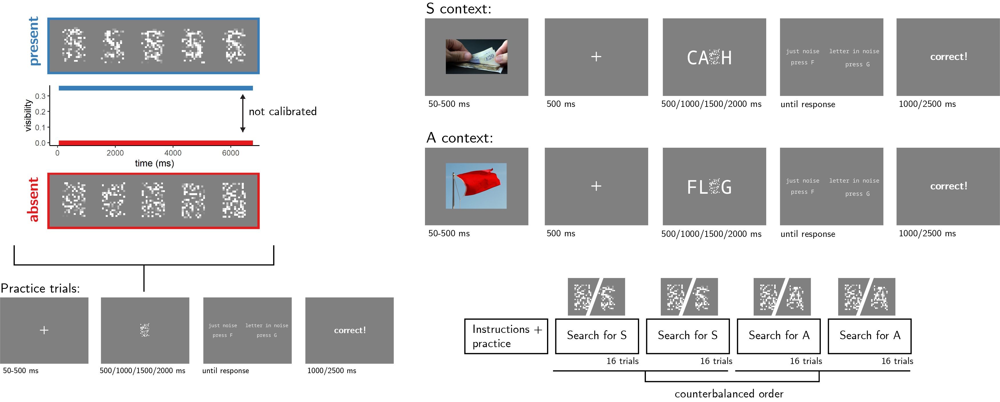

```{r setup, include = FALSE}
library("papaja")
library('pwr')
library('dplyr')
r_refs("r-references.bib")
knitr::opts_chunk$set(fig.pos = "!H", out.extra = "")
```

```{r analysis-preferences}
# Seed for random number generation
set.seed(42)
knitr::opts_chunk$set(cache.extra = knitr::rand_seed)
```

# Motivation

In previous two experiment, participants performed a letter detection task, where on different trials the target letter (e.g., 'S') was sometimes congruent and sometimes incongruent with a context word (for example, S is congruent with KI_S, but incongruent with FL_G). As expected, decisions about letter absence were overall slower than decisions about letter presence. Furthermore, subjects more readily detected the presence of a letter when the context was congruent, compared to incongruent with the target letter. However, we found no effect of context congruency on the time taken to infer the absence of a target. Specifically, subjects did not infer absence earlier in a congruent context although they could have safely done so without increasing their miss rate. 

In this Experiment, we test whether this finding is due to subjects not having metacognitive access into the effects of context on perception, or alternatively, due to an implicit decision to keep the decision times similar between the two conditions, at the cost of differences in hit rate. To decide between these two alternatives, we manipulated stimulus presentation time and measured accuracy as a function of presentation time and context. When a target is present, we expect hit rate to increase as a function of presentation time, as well as to be higher in congruent contexts, as was the case in Exp. 1 and 2. Our predictions for target-absent trials, however, depend on participants' insight into the effects of context on perception. If participants expect targets to be more visible in congruent contexts, correct rejection rate should increase in congruent contexts too. But if participants do not have such expectations, correct rejection rate should be unaffected by context. 


# Methods
We report how we determined our sample size, all data exclusions (if any), all manipulations, and all measures in the study. Changes relative to Exp. 2 appear in **bold letters**.<!-- 21-word solution (Simmons, Nelson & Simonsohn, 2012; retrieved from http://ssrn.com/abstract=2160588) -->

## Participants

The research complies with all relevant ethical regulations, and was approved by the Research Ethics Committee of Birkbeck, University of London (study ID number 1812000). Participants will be recruited via Prolific, and will give informed consent prior to their participation. To be eligible to take part in this study, their Prolific approval rate will need to be 95% or higher, their reported first language English, and their age between 18 and 60. We will  collect data until we reach 300 included participants (after applying our pre-registered exclusion criteria). The entire experiment will take 11 minutes to complete. Participants will be paid £1.38 for their participation, equivalent to an hourly wage of £7.50.

## Procedure

Participants will detect the presence or absence of a target letter (S or A, in different blocks) in a patch of dynamic grayscale noise presented at 15 frames per second. In each frame, noise will be generated by randomly sampling grayscale values from a target image $I$. Specifically, for each pixel $S_{ij}$, we will display the grayscale value for the corresponding pixel in the original image $I_{ij}$ with some probability $p$, and the grayscale value of a randomly chosen pixel $I_{i'j'}$ with probability $1-p$. On target-absent trials, $p$ will be set to $0$, such that the grayscale values of all pixels will be randomly shuffled. **Visibility level will be set to $v=0.23$**. **Stimuli will be presented for varying durations: 500, 1000, 1500 or 2000 milliseconds. After stimulus presentation, responses will be delivered using the F and G keyboard keys**, and response-mapping will be counterbalanced across subjects.

```{r design, echo=FALSE, fig.cap="Experimental design. Top left: target visibility as a function of frame number for in target present (blue) and target absent (red) trials. Bottom left: trial structure in practice trials. Top right: trial structure in the main blocks of the experiment, in S- and A- context trials. Bottom right: overall experiment structure. ", out.width = '75%'}

```

After reading the instructions, participants will complete four practice trials. In case their accuracy in these four practice trials falls below 3/4, they will be reminded of task instructions and given additional practice trials until they reach the desired accuracy level. Otherwise, they will continue to the main part of the experiment. Here, their task will be exactly the same, but the noise patch will be embedded in a congruent or incongruent context word. For example, when searching for the letter S, the context word CA_H (cash) is congruent but the context word FL_G (flag) is not (see Fig. \@ref(fig:design), upper right panel). To make sure participants are primed with the correct reading of the context word, an image of its meaning will be presented for 500 ms following the fixation cross and prior to the presentation of the noise display.

The main part of the experiment will comprise four blocks of 16 trials. For approximately half of the participants, in blocks 1 and 2 the target letter will be S and in blocks 3 and 4 it will be A. The order of letters will be reversed for the other half. All context words will be presented twice: once when detecting the letter S and once when detecting the letter A. As a result, all context words will be presented both as congruent and as incongruent contexts for the target letter. Overall, there will be 32 context words: 16 where the missing letter is an A and 16 where it is an S. All words will be 4- or 5-letter nouns with S or A in one of the central positions (i.e., position 2 or 3 in 4-letter words and position 3 in 5-letter words).

### Randomization

The order and timing of experimental events will be determined pseudo-randomly by the Mersenne Twister pseudorandom number generator, initialized in a way that ensures registration time-locking [@mazor2018novel]. 

## Data analysis

### Rejection criteria

Participants will be excluded if their accuracy falls below 50%.

### Hypotheses and analysis plan

This study is designed to test several hypotheses about the effects of expectation and context on visual detection, with a focus on the effect of context on correct rejection rate as a potential window into self-modeling and metacognitive knowledge about perception and attention.

*Hypothesis 1 (PRESENCE/ABSENCE RESPONSE TIME)*: We will test the null hypothesis that response times are similar for target-absent and target-present responses, aiming to replicate the finding that decisions about the absence of a target are slower than decisions about its presence [@mazor2021metacognitive; @mazor2020distinct]. This will be tested using a paired t-test on the median individual level-response times. 

*Hypothesis 2 (PRESENTATION TIME EFFECT ON HIT RATE)*: We will test the null hypothesis that hit rate (the proportion of 'target-absent' responses out of all target-absent trials) is unaffected by presentation time. This will be operationalized as the main effect of presentation time in a within-subject two-way ANOVA with presentation time and context congruency as independent variables, and hit rate as the dependent variable. Here and in all following statistical tests where the dependent variable is hit- or correct-rejection rate, a p-value will be extracted by comparing the F value to an empirical null distribution of label-shuffled F-values (here, maintaining subject identity and context, but shuffling presentation time).

*Hypothesis 3 (CONTEXT EFFECT ON HIT RATE)*: We will test the null hypothesis that hit rate is similar when the context word matches or does not match the target letter. This will be operationalized as the the main effect of presentation time in a within-subject two-way ANOVA with presentation time and context congruency as independent variables, and, and hit rate as the dependent variable.

*Hypothesis 4 (PRESENTATION TIME EFFECT ON CORRECT REJECTION RATE)*: We will test the null hypothesis that correct rejection rate (the proportion of 'target-absent' responses out of all target-absent trials) is unaffected by presentation time. This will be operationalized as the main effect of presentation time in a within-subject two-way ANOVA with presentation time and context congruency as independent variables, and correct-rejection rate as the dependent variable. 

*Hypothesis 5 (CONTEXT EFFECT ON CORRECT REJECTION RATE)*: We will test the null hypothesis that correct-rejection rate is similar when the context word matches or does not match the target letter. This will be operationalized as the the main effect of presentation time in a within-subject two-way ANOVA with presentation time and context congruency as independent variables, and, and correct-rejection rate as the dependent variable.

*Hypothesis 6 (CONTEXT RESPONSE INTERACTION)*: We will test the null hypothesis that the effect of context on accuracy is similar in target-absent and target-present responses. This will be tested by performing a group-level t-test on the subject-level contrast $(accuracy_{P,C}-accuracy_{P,I})-(accuracy_{A,C}-accuracy_{A,I})$ Where $P$, $A$, $C$ and $I$ stand for present, absent, congruent (matching) and incongruent (non-matching), respectively.

*Hypothesis 7 (SENSITIVITY)*: We will test the null hypothesis that sensitivity (measured as d') is equal in matching and non-matching contexts. To allow the extraction of d' for participants who committed no false-alarms or misses, we will add 0.5 to miss, hit, false-alarm and correct rejection counts [@snodgrass1988pragmatics].

*Hypothesis 8 (CRITERION)*: We will test the null hypothesis that decision criterion (measured as c) is equal in matching and non-matching contexts. To allow the extraction of a decision criterion for participants who committed no false-alarms or misses, we will add 0.5 to miss, hit, false-alarm and correct rejection counts [@snodgrass1988pragmatics].

## Sample size justification

In Exp. 2, we found a significant effect of context on hit rate (standardized effect size: $0.36$), with no significant effect on correct rejection rate (standardized effect size: $0.09$). The difference between the two effects was significant ($p<0.001$), with a standardized effect size of $0.34$. A sample size of `r pwr.t.test(d=0.34,power=0.95,type='paired')$n%>%ceiling()` is therefore sufficient for 95% in this design. We note, however, that in Exp. 1 the effect size estimate was much smaller ($0.17$), requiring a sample size of `r pwr.t.test(d=0.17,power=0.95,type='paired')$n%>%ceiling()` to achieve the same statistical power. Exp. 3 is closer to Exp. 2 in that the letter will appear immediately instead of gradually. We will therefore collect data until we reach 200 included participants, according to our pre-registered including criteria, allowing us to detect an effect size of $0.26$ standard deviations with 95% power. 


```{r power, echo=FALSE, fig.cap="Power curve for a two-tailed paired t-test with a true effect size of 0.2 standard devitations. With 300 participants, we will have 93% statistical power under such settings. ", out.width = '75%'}
Exp2.pwr <- pwr.t.test(n=200,d=0.26,type='paired');
plot(Exp2.pwr)
```

# References

\begingroup
\setlength{\parindent}{-0.5in}
\setlength{\leftskip}{0.5in}

<div id="refs" custom-style="Bibliography"></div>
\endgroup
